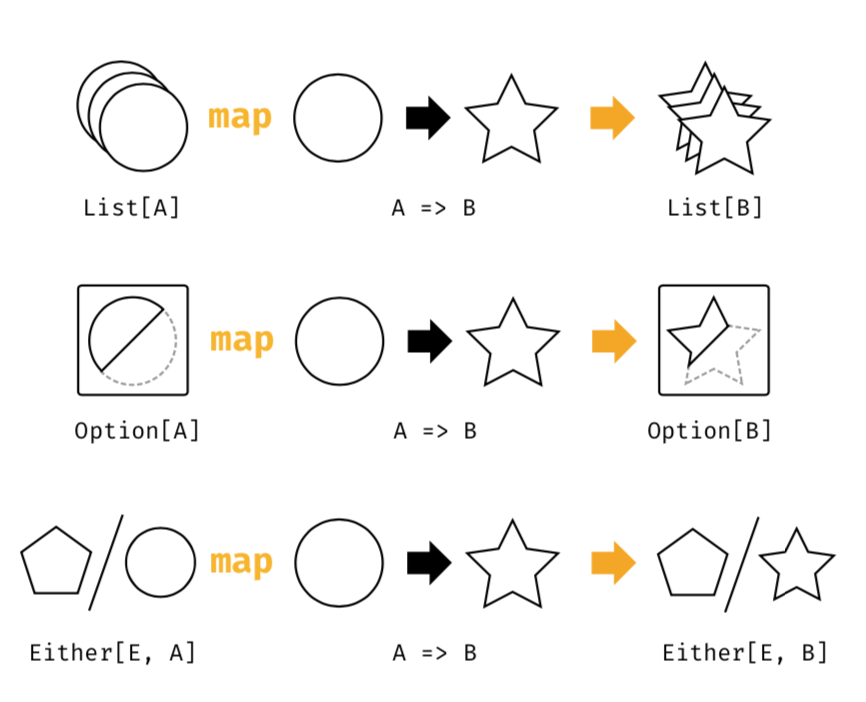
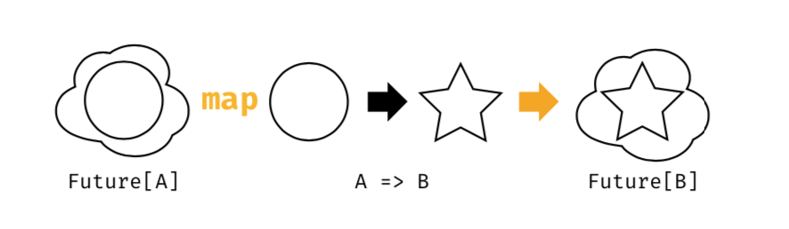
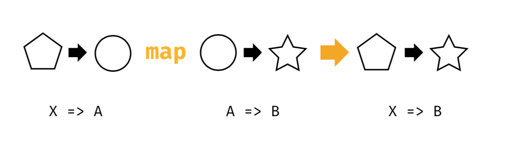
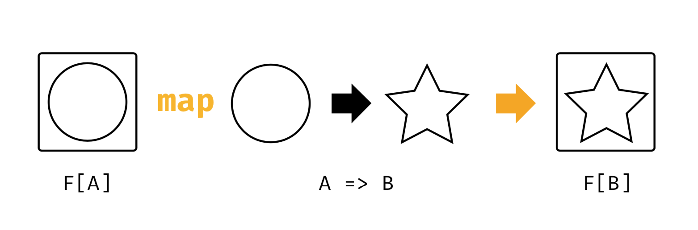
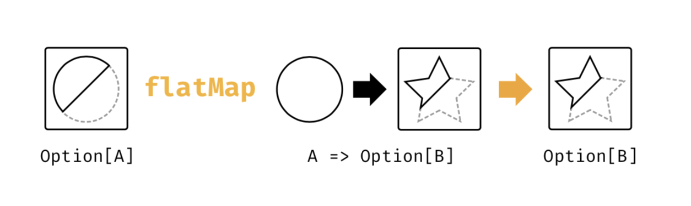
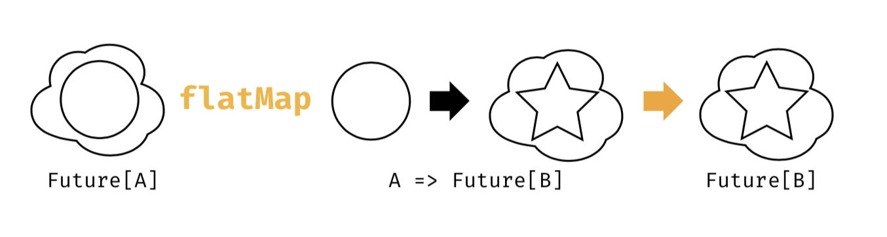

# Scala with cats 中文翻译


### 前言

本书的主要目的有两个：

- 介绍 monads , functors 和其他函数式编程模式以及它们的设计结构；
- 以上这些概念在 Cats 中是如何实现的；

Monads 及相关概念对于函数式编程来说，就相当于面向对象编程中的设计模式，主要用于重用设计。但相比面向对象设计模式来说主要有两个不同：

- 它是有严格定义的
- 它是非常普遍，通用的

这两个点似乎非常难以理解，而且也非常抽象，然而，类似于 Monads 的概念却被应用在各种各样的场景中。

在这本书中我们通过多种方式来阐述这些概念，帮助你理解这些模型，它们是怎么使用的以及什么场景下是合适的。

我们使用各种案例，图片展示，许多的小例子，当然还有数学定义，希望通过它们，你能从中得到对你有价值的东西。

Ok，让我们开始吧！

### 版本

这本书是基于 `Scala 2.12.3` 和 `Cats 1.0.0`，以下是build.sbt的一部分，包含相关的依赖和设置：

```scala
scalaVersion := "2.12.3"

libraryDependencies +=
  "org.typelevel" %% "cats-core" % "1.0.0"

scalacOptions ++= Seq(
  "-Xfatal-warnings",
  "-Ypartial-unification"
)
```

### 模版工程

为了方便，我们创建了一个Giter8 template工程，你可以直接使用，通过以下方式clone到本地：
```shell
$ sbt new underscoreio/cats-seed.g8
```

 它会生成一个项目包含Cats的相关依赖，有关如何运行示例代码或者在Scala控制台进行交互，请参考README.md。

cats-seed 是一个最简版的 template，如果你更喜欢 ba􏰁eries-included star􏰀ng point，可以切换使用 Typelevel 的 sbt-catalysts template:

```shell
$ sbt new typelevel/sbt-catalysts.g8
```

 它会生成一个包含一组依赖和编译插件的工程，以及单元测试和[tut-enabled](https://github.com/tpolecat/tut) 文档（这个项目已经废弃）相关的模版，更多信息请看项目的主页[catalysts](https://github.com/typelevel/catalysts)和[sbt-catalysts](https://github.com/typelevel/sbt-catalysts)。

以上操作需使用SBT 0.13.13 及以上版本。

### 本书排版

本书包含了很多的技术信息和程序代码，我们使用很多排版约定来减少歧义并突出重要的概念。

#### 排版约定

新的术语和短语以斜体显示。 在基础的介绍之后，将使用普通的罗马字体。

程序代码，文件名以及文件内容中的术语将用等宽字体书写。 请注意，我们不会区分单数形式和复数形式。 例如，我们可能使用 `String` 或 `Strings` 来代表`java.lang.String`。

对外部资源的引用将以超链接的形式出现， 另外使用超链接和等宽字体组合来引用API文档，例如：[scala.Option](https://www.scala-lang.org/api/current/scala/Option.html)。

#### 源代码

源代码块将会按照下面这个例子书写，适当的高亮语法显示：

```scala
object MyApp extends App {
  println("Hello world!") // Print a fine message to the user!
}
```

大多数代码通过tut来进行编译。 tut背后使用了Scala控制台，因此我们将一些控制台样式的输出显示为注释：

```scala
 "Hello Cats!".toUpperCase
// res0: String = HELLO CATS!
```

#### 标注框

我们使用两种类型的标注框来突出特别的内容：

。。。

### 致谢

。。。

### 支持者

。。。


## <center>Part I</center>


## <center>Theory</center>


### Chapter 1

## 介绍

Cats 包含各种各样的函数式编程工具，并允许开发者自己选择想要使用的内容。 这些工具多数以 type class 的形式提供，我们可以将其应用于现有的 Scala 类型。

Type class 是一种编程范式源自于 Haskell，它允许我们不通过传统的继承以及修改代码的方式便可以给原有的代码加上新功能。

在本章中我们将会刷新你之前在 [Essen􏰂al Scala]() 这本书中理解的 type  class 概念，首先我们来看一下 Cats 的代码库。我们将会使用两个 type class 的例子，`Show` 和 `Eq`，利用它们为这本书做一个铺垫。

我们将type class应用在抽象数据类型，模式匹配，value classes，和类型别名，presenti􏰂ng a structured approach to functi􏰂onal programming in Scala.

（上述中的“class”这个词并不直接等价于 scala 或者 java 中的类）


### 1.1 剖析Type class

Type class模式主要由3个模块组成：

- Type class self
- Type class Instances
- Type class interface

#### 1.1.1 The Type Class

Type class 可以看成一个接口或者 API，用于定义我们想要实现功能。在 Cats 中，Type class相当于至少带有一个类型参数的 trait。举个例子，我们可以通过以下的代码描述一个基本的功能：“序列化成 JSON”。

```scala
// Define a very simple JSON AST 声明一些简单的JSON AST
sealed trait Json
final case class JsObject(get: Map[String, Json]) extends Json 
final case class JsString(get: String) extends Json
final case class JsNumber(get: Double) extends Json
case object JsNull extends Json

// The "serialize to JSON" behaviour is encoded in this trait 序列话JSON方法定义在这个Trait里
trait JsonWriter[A] {
  def write(value: A): Json
}
```

 这个例子中 `JsonWriter` 就是我们定义的一个 type class，上述代码中还包含Json类型相关的代码。

#### 1.1.2 Type Class Instances

Type Class 实例就是对特定类型的 Type Class 的实现，包括Scala的基本类型以及我们自己定义的类型。

在Scala中，我们通过创建一个 Type Class 的实现来进行 Type Class 实例的声明，并用 **implicit** 这个关键词进行标记：

```scala
final case class Person(name: String, email: String)
object JsonWriterInstances {
  implicit val stringWriter: JsonWriter[String] =
    new JsonWriter[String] {
      def write(value: String): Json =
        JsString(value)
    }
  implicit val personWriter: JsonWriter[Person] =
    new JsonWriter[Person] {
      def write(value: Person): Json =
        JsObject(Map(
          "name" -> JsString(value.name),
          "email" -> JsString(value.email)
        ))
}
// etc...
}
```

#### 1.1.3 Type Class Interfaces

Type Class  Interface 包含对我们想要对外部暴露的功能。interfaces是指接受 type class instance 作为 `implicit` 参数的泛型方法。

通常有两种方式去创建 interface：

- Interface Objects
- Interface Syntax

##### Interface Objects

创建 interface 最简单的方式就是将方法放在一个单例object中：

```scala
object Json {
  def toJson[A](value: A)(implicit w: JsonWriter[A]): Json = w.write(value)
}
```

在使用之前，我们需要导入我们所需的 type class instances，然后就可以调用相关的方法：

```scala
import JsonWriterInstances._
Json.toJson(Person("Dave", "dave@example.com"))
// res4: Json = JsObject(Map(name -> JsString(Dave), email -> JsString
     (dave@example.com)))
```

这里我们并没有指定对应的 implicit parameters，但是编译器会帮我们在导入的 type class instances 中寻找一个跟相应类型匹配的 type class instance，并插入对应的位置：

```scala
Json.toJson(Person("Dave", "dave@example.com"))(personWriter)
```

##### Interface Syntax

我们也可以使用扩展方法使已存在的类型拥有 interface methods，在 Cats 中将此称为 “*syntax*”：

```scala
object JsonSyntax {
  implicit class JsonWriterOps[A](value: A) {
    def toJson(implicit w: JsonWriter[A]): Json =
      w.write(value)
  } 
}
```

使用 interface syntax 之前，我们除了导入它本身以外，还需导入我们所需的 type class instance：

```scala
import JsonWriterInstances._
import JsonSyntax._
Person("Dave", "dave@example.com").toJson
// res6: Json = JsObject(Map(name -> JsString(Dave), email -> JsString(dave@example.com)))
```

 同样，编译器会自动帮我们寻找所需implicit parameters并插入对应的位置：

```scala
Person("Dave", "dave@example.com").toJson(personWriter)
```

##### The implicitly Method

Scala 标准库提供了一个泛型的 type class interface 叫做 implicitly，它的声明非常简单：

```scala
 def implicitly[A](implicit value: A): A = value
```

它接收一个 implicit 参数并返回该参数，我们可以使用 implicitly 调用 implicit scope 中的任意值，只需要指定对应的类型无需其他操作，便能得到对应的 instance 对象。

```scala
import JsonWriterInstances._
// import JsonWriterInstances._
implicitly[JsonWriter[String]]
// res8: JsonWriter[String] = JsonWriterInstances$$anon$1@38563298
```

在 Cats 中，大多数 type class 都提供了其他方式去调用对应的 instance。但是在代码调试过程中，implicitly 有着很大的用处。我们可以在代码中插入implicitly 相关代码，来确保编译器能找到对应的 type class instance（若无对应的 type class instance 则编译的时候会抱错）以及不会出现歧义性（比如 implicit scope 存在两个相同的 type class instance）。

### 1.2 使用 Implicits

对于 Scala 来说，使用 type class 就得跟 implicit values 和 implicit parameters 打交道，为了更好的使用它，我们需要了解以下几个点。

#### 1.2.1 组织 Implicits

奇怪的是,在Scala中任何标记为implicit的定义都必须放在object或trait中，而不是放在顶层。在上一小节的例子中，我们将所有的type class instances打包放在JsonWriterInstances中。同样我们也可以把它放在JsonWriter的伴生对象中，这种方式在Scala中有特殊的含义，因为这些instances会直接在*implicit scope*里面，无需单独导入。

#### 1.2.2 Implicit 作用域

正如我们看到的一样，编译器会自动寻找对应类型的type class instances，举个例子，下面这个例子就会编译器就会自动寻找**JsonWriter[String]**对应的instance：

```scala
Json.toJson("A string!")
```

编译器会从以下几个*implicit scope*中寻找适合的instance：

- 自身及继承范围内的 instance
- 导入范围内的 instance
- 对应 type class 以及参数类型的伴生对象中

只有用 implicit 关键词标注的instance才会在 *implicit scope*，而且如果编译器在引入的 implicit scope 中发现重复的 instance 声明，则会编译抱错：

```scala
implicit val writer1: JsonWriter[String] =
  JsonWriterInstances.stringWriter
implicit val writer2: JsonWriter[String] =
  JsonWriterInstances.stringWriter
Json.toJson("A string")

// <console>:23: error: ambiguous implicit values:
// both value stringWriter in object JsonWriterInstances of type => JsonWriter[String]
//  and value writer1 of type => JsonWriter[String]
// match expected type JsonWriter[String] 
// Json.toJson("A string")
//
```

但 Scala 中的 *implicit* 规则远比这复杂的多，但这些不在本书的讨论范围之内（如果你想对 *implicit* 有更深入的了解，可以参考这些内容：[this Stack Overflow post on implicit scope](https://stackoverflow.com/questions/5598085/where-does-scala-look-for-implicits)和[this blog post on implicit priority](http://eed3si9n.com/revisiting-implicits-without-import-tax)）。对于我们来说，通常把type class instances放在以下四个地方：

1. 一个单独的object中，比如上面提到的JsonWriterInstances；
2. 一个单独的trait中；
3. type class的伴生对象中；
4. 我们所使用类型的伴生对象中，比如JsonWriter[A]，即A的伴生对象中；

如果是第一种方式的，我们在使用之前通过import导入，第二种方式的话通过继承trait引入，另外两种方式的，无需单独导入，它们默认就在对应类型的implicit scope中。

#### 1.2.3 Recursive Implicit Resolu􏰀on

编译器除了能直接寻找对应类型type class instance，还拥有组合type class instance的能力。

之前我们都是通过 implicit val来声明type class instances ，这非常简单，实际上我们有两种方式去声明instances：

1. 通过 implicit val来声明具体类型的type class instances；
2. 利用 implicit methods通过其他类型的type class instances来生成新的instances；

我们为什么要通过其他类型的type class instances来生成新的instances呢？一个很明显的例子，我们如何让Option类型可以应用JsonWriter这个type class。对于系统中的任意类型的Option[A]，都得需要有对应的type class instance，我们可能会尝试通过声明所有instance：

```scala
implicit val optionIntWriter: JsonWriter[Option[Int]] = ???
implicit val optionPersonWriter: JsonWriter[Option[Person]] = ???
// and so on...
```

显然，这种方式是不易扩展的，对于系统中的任意类型A，我们都必须去声明两个instance，一个作用于A，一个作用于Option[A]。

幸运的是，我们可以基于A的instance来构造Option[A]的instance，而且这是一个通用逻辑：

- 假如option是Some(a: A)，则使用A的instance；
- 假如option是None，则返回JsNull；

我们通过implicit def来实现：

```scala
implicit def optionWriter[A](implicit writer: JsonWriter[A]): JsonWriter[Option[A]] =
  new JsonWriter[Option[A]] {
    def write(option: Option[A]): Json =
      option match {
        case Some(aValue) => writer.write(aValue)
        case None         => JsNull
		} 
 }
```

这个方法包含一个implicit参数writer，并通过它来构造一个Option[A]的JsonWriter instance。我们来看一个表达式：

```scala
Json.toJson(Option("A string"))
```

编译器首先会去寻找对应的type class instance，这里是optionWriter[String]，所以为表达式加上对应的implicit参数：

```scala
Json.toJson(Option("A string"))(optionWriter[String])
```

因为这里optionWriter是用implicit def声明的，而且需要一个implicit writer: JsonWriter[A]参数，所以编译器会继续寻找，这里的对应instance是stringWriter，最终完整的表达式：

```scala
Json.toJson(Option("A string"))(optionWriter(stringWriter))
```

通过这种方式，编译器会在引入的implicit scope中竟可能的寻找符合的instance，最终组合成所需要类型的type class instance。

> *Implicit Conversions*
>
> 在我们使用implicit def构建type class instance的时候，我们使用implicit参数，如果我们不使用implicit声明参数，编译器则不会自动去寻找填充参数。
>
> 使用implicit方法但是不使用implicit parameters在Scala中是另一种模式，叫做*implicit conversion*。跟之前内容中提到的Interface Syntax也是不同的，它是一个implicit class并使用扩展方法。implicit conversion是一种古老的编程模式，目前Scala已经不赞成使用了。而且当你使用该语法时，编译器会提出警告，如果你确定要使用，则需手动引入scala.language.implicitConversions：
>
> ```scala
> implicit def optionWriter[A]
> (writer: JsonWriter[A]): JsonWriter[Option[A]] =
> ???
> // <console>:18: warning: implicit conversion method optionWriter should be enabled
> // by making the implicit value scala.language.implicitConversions visible.
> // This can be achieved by adding the import clause 'import scala.language.implicitConversions'
> // or by setting the compiler option -language: implicitConversions.
> // See the Scaladoc for value scala.language.implicitConversions for a discussion
> // why the feature should be explicitly enabled.
> //
> //     implicit def optionWriter[A]
>                     ^
> // error: No warnings can be incurred under -Xfatal-warnings.
> ```
>
> 

### 1.3 Exercise: Printable Library

Scala可以通过toString方法将一个任意一个值转换成String。但是这种方式有一些缺陷：

- 它对Scala中的每个类型都进行了实现，但是使用有很大限制；
- 不能对特定类型进行特定的实现；

让我们声明一个Printable type class去解决这些问题吧：

1. 声明一个type class Printable[A]包含一个方法format，该方法接受一个类型为A的参数并返回String。
2. 创建一个名为PrintableInstances的object，包含Printable[String]和Printable[Int]的instance声明。
3. 创建一个名为Printable的object，包含两个泛型方法：
   1. format方法：接受一个类型为A的参数和相关类型的Printable，使用Printable将参数转换为String。
   2. print方法：与format方法参数一致，但返回值时Unit，它执行的操作是通过println将类型为A的参数输出到控制台。

代码见[示例]()

#### 1.3.1 Using the Library

我们可以把Printable这个功能封装成类库，然后在使用的地方引入，我们先来定义一个case class：

```scala
final case class Cat(name: String, age: Int, color: String)
```

接下来我们实现一个Printable[Cat]类型的instance，对应format的返回结果应为：

```scala
NAME is a AGE year-old COLOR cat.
```

 最后我们对功能进行了实现（代码见[示例]()）

#### 1.3.2 Bett􏰁er Syntax

我们将使用前面介绍的**Interface Syntax**的语法，让Printable相关的功能更容易使用：

1. 创建一个PrintableSyntax的object。
2. 在PrintableSyntax中声明一个implicit class PrintableOps[A]对A类型的值进行包装。
3. 在PrintableOps[A]声明两个方法：
   - format接受一个implicit Printable[A]的参数，返回String；
   - print接受一个implicit Printable[A]的参数，返回Unit；
4. 使用扩展方法对上一个例子进行不一样实现；

（代码见[示例]()）

### 1.4 Meet Cats

在先前的章节我们学习了如何在Scala中去实现一个type class，在本节中我们学习Cats中实现的type class。

Cats是的设计是模块化，你可以自由选择自己想要的type class、instance、interface methods。让我们来看第一个例子：[cats.Show](http://typelevel.org/cats/api/cats/Show.html)。

Show的功能跟我们在上节实现的Printable基本一致。它的主要功能就是帮助我们将数据以更友好的方式输出的控制台，而不是通过toString方法，下面是它的一个简要声明：

```scala
package cats
trait Show[A] {
  def show(value: A): String
}
```

#### 1.4.1 Impor􏰀ng Type Classes

Show这个type class声明在[cats](http://typelevel.org/cats/api/cats/)这个包里，我们可以直接进行import：

```scala
import cats.Show
```

在Cats中，每个type class的伴生对象中都有一个apply方法，用于查找我们指定类型对应的instance：

```scala
val showInt = Show.apply[Int]
// <console>:13: error: could not find implicit value for parameter
//  instance: cats.Show[Int]
// val showInt = Show.apply[Int]
```

糟糕，竟然报错了，因为apply方法是通过implicit来查找对应的instance，所以我们需要导入相应的instance到implicit scope。

#### 1.4.2 Impor􏰀ng Default Instances

 [cats.instances](https://typelevel.org/cats/api/cats/instances/)这个包提供了很多默认实现的instances，我们可以通过一下方式来引入它们，每种类型的包都包含了该类型对于Cats中所有type class的instance实现：

- [cats.instances.int](https://typelevel.org/cats/api/cats/instances/package$$int$)提供所有Int的instances
- [cats.instances.string](https://typelevel.org/cats/api/cats/instances/package$$string$)提供所有Stirng的instances
- [cats.instances.list](https://typelevel.org/cats/api/cats/instances/package$$list$)提供所有List的instances
- [cats.instances.option](https://typelevel.org/cats/api/cats/instances/package$$option$)提供所有Option的instances
- [cats.instances.all](https://typelevel.org/cats/api/cats/instances/package$$all$)提供Cats中的所有instances

有关可用导入的详细信息，请参见[cats.instances](https://typelevel.org/cats/api/cats/instances/)包。

让我们来引入Int和String对应Show的instances：

```scala
import cats.instances.int._    // for Show
import cats.instances.string._ // for Show

val showInt: Show[Int] = Show.apply[Int] 
val showString: Show[String] = Show.apply[String]
```

很好，我们引入了Int和String对应Show的instances，现在可以使用它们来打印Int和String的数据：

```scala
val intAsString: String = showInt.show(123)
// intAsString: String = 123

val stringAsString: String = showString.show("abc")
// stringAsString: String = abc
```

#### 1.4.3 Impori􏰀ng Interface Syntax

我们可以使用*interface syntax*让Show变的更容易使用，首先我们需要先导入[cats.syntax.show](https://typelevel.org/cats/api/cats/syntax/package$$show$)，它会为任意类型添加一个show的扩展方法，前提是implicit scope已经有了对应类型的instance：

```scala
import cats.syntax.show._ // for show

val shownInt = 123.show
// shownInt: String = 123

val shownString = "abc".show
// shownString: String = abc
```

Cats为每一个type class都提供了syntax，我们可以按需使用，在后面的章节，我们会继续它们。

#### 1.4.4 Impori􏰀ng All The Things!

在这本书中，我们对于每个示例都是按需导入，只导入需要的instance和syntax。然而，有些时候这也是相当费时的，你可以通过以下方式简化导入：

- import cats._  导入Cats中所有的type class
- import cats.instances.all._ 导入Cats中所有的instances
- import cats.syntax.all._ 导入Cats中所有的syntax
- import cats.implicits._  导入Cats中所有的instances和syntax

大多数时候我们只需要全部导入即可：

```scala
import cats._
import cats.implicits._
```

但当遇到命名冲突或者implicit冲突的时候，我们就需要更具体导入。

#### 1.4.5 Defining Custom Instances

下面我们来自定义一个关于Show的instance：

```scala
import java.util.Date

implicit val dateShow: Show[Date] =
  new Show[Date] {
    def show(date: Date): String =
      s"${date.getTime}ms since the epoch."
}
```

但是，Cats提供了一些更简洁的方法去声明instance。对于Show来说，在其伴生对象中有两个方法帮助我们创建自定义类型的instance：

```scala
object Show {
  
  // Convert a function to a `Show` instance:
  def show[A](f: A => String): Show[A] = ???
  
  // Create a `Show` instance from a `toString` method:
  def fromToString[A]: Show[A] = ???
}
```

使用这些方法会比传统创建instance的方式更加快速：

```scala
implicit val dateShow: Show[Date] = Show.show(date => s"${date.getTime}ms since the epoch.")
```

我们可以看到，确实简洁了不少，Cats为很多type class都提供了类似的辅助方法来创建instance，可以从头直接创建instance，也可以基于其他类型的instance创建新的instance，比如：基于Int类型的instance创建Option[Int]类型的instance。

#### 1.4.6 Exercise: Cat Show

使用Show type class重写上面章节Printable的例子，代码见[示例]()

### 1.5 Example: Eq

本章节我们继续来学习一个非常实用的type class：[cats.Eq](https://typelevel.org/cats/api/cats/kernel/Eq.html)。Eq主要是为了类型安全的判等设计的，因为Scala内置的 ==操作符有时会给我们带来困扰。

大多数Scala程序员都应该写过类似下面的代码：

```scala
List(1, 2, 3).map(Option(_)).filter(item => item == 1)
// res0: List[Option[Int]] = List()
```

可能很多人都不会犯这么简单的错误，但是这是可能存在的，filter里面的判断逻辑会一直返回false，因为Int和Option[Int]是不可能相等的。

这是开发者的错，我们应该用Some(1)去比较而不是1。然而这在技术上来说并不能说它是错的，因为==可以作用于任意的两个对象，不用关心具体的类型。Eq的设计，解决了这个问题，因为它是类型安全的。

#### 1.5.1 Equality, Liberty, and Fraternity

我们可以使用Eq对任意给定类型的对象进行类型安全的判等：

```scala
package cats

trait Eq[A] {
  def eqv(a: A, b: A): Boolean
  // other concrete methods based on eqv...
}
```

与Show类似，关于Eq的interface syntax，声明在[cats.syntax.eq](https://typelevel.org/cats/api/cats/syntax/package$$eq$)这个包中，它提供了两个执行判等的方法，你可以直接使用，当然前提是在implicit scope中有对于的instance：

- === 比较两个对象相等
- =!= 比较两个对象不相等

#### **1.5.2 Comparing Ints**

让我们来看些例子，首先我们需要先导入对应的type class:

```scala
import cats.Eq
```

接着，我们来获取一个Int的instance：

```scala
import cats.instances.int._ // for Eq

val eqInt = Eq[Int]
```

我们可以直接使用eqInt来进行判等：

```scala
eqInt.eqv(123, 123)
// res2: Boolean = true

eqInt.eqv(123, 234)
// res3: Boolean = false
```

 不同于Scala的==操作符，假如你试图用eqv去比较两个不同类型的对象时，编译将会报错：

```scala
eqInt.eqv(123, "234")
// <console>:18: error: type mismatch; // found : String("234")
// required: Int
// eqInt.eqv(123, "234")
// ^
```

我们同样可以使用interface syntax语法，需要先导入[cats.syntax.eq](https://typelevel.org/cats/api/cats/syntax/package$$eq$)，然后我们就可以直接使用 === 和 =!=方法：

```scala
import cats.syntax.eq._ // for === and =!=

123 === 123
// res5: Boolean = true

123 =!= 234
// res6: Boolean = true
```

同样，我们尝试去比较两个不同类型的对象时也会编译报错：

```scala
123 === "123"
// <console>:20: error: type mismatch;
//  found   : String("123")
//  required: Int
//        123 === "123"
//         
```

#### **1.5.3 Comparing Op􏰀ons**

接下来我们来看一个更有趣的例子—Option[Int]。如果要比较Option[Int]类型的值，我们需要先导入Option以及Int对应的instances：

```scala
import cats.instances.int._    // for Eq
import cats.instances.option._ // for Eq
```

现在我们来尝试进行一些比较：

```scala
Some(1) === None
// <console>:26: error: value === is not a member of Some[Int] // Some(1) === None
// 
```

编译发现了一个错误，因为类型没匹配上，我们导入的是Int以及Option[Int]对应Eq的instances，所以Some[Int]是无法比较的。要解决这个问题我们需要将参数的类型指定为Option[Int]：

```scala
 (Some(1) : Option[Int]) === (None : Option[Int])
// res9: Boolean = false
```

更友好的方式是利用标准库中的Option.apply和Option.empty方法：

```scala
 Option(1) === Option.empty[Int]
// res10: Boolean = false
```

或者使用[cats.syntax.option](https://typelevel.org/cats/api/cats/syntax/package$$option$)中特殊的语法：

```scala
import cats.syntax.option._ // for some and none

1.some === none[Int]
// res11: Boolean = false
1.some =!= none[Int]
// res12: Boolean = true
```

#### **1.5.4 Comparing Custom Types**

我们可以为自定义的类型创建一个关于Eq的instance，它接收一个(A, A) => Boolean 的方法返回一个Eq[A]：

```scala
import java.util.Date
import cats.instances.long._ // for Eq

implicit val dateEq: Eq[Date] =
  Eq.instance[Date] { (date1, date2) =>
    date1.getTime === date2.getTime
  }
val x = new Date() // now
val y = new Date() // a bit later than now

x === x
// res13: Boolean = true
x === y
// res14: Boolean = false
```

#### **1.5.5 Exercise: Equality, Liberty, and Felinity**

实现一个Cat类型关于Eq的instance：

```scala
final case class Cat(name: String, age: Int, color: String)
```

并对下面这些对象进行判等操作：

```scala
val cat1 = Cat("Garfield",   38, "orange and black")
val cat2 = Cat("Heathcliff", 33, "orange and black")

val optionCat1 = Option(cat1)
val optionCat2 = Option.empty[Cat]
```

 代码见[示例]()

### 1.6 Controlling Instance Selec􏰀on

 在使用type class的时候，我们必须考虑以下两个问题，因为它们对于如何选择instance至关重要：

- 假设B是A的子类型，那么声明为A类型的instance能作用于B吗？

  举个例子，假如我们声明了一个JsonWriter[Option[Int]]的instance，那么Json.toJson(Some(1))能使用这个instance吗？（Some是Option的子类型）

- xxxx

#### **1.6.1 Variance**

当我们在声明type class时，可以使用可变的类型参数，这样可以让type class也有“变型”的能力。

在Essential scala中提到，variance跟子类型有关，假如可以在任意接收A类型值的地方用B类型值代替，那么可以说B是A的子类型。

当我们在定义类型构造器的时候，可以使用annotations来标明它是否是支持协变或者逆变的。举个例子，我么可以使用**”+“**符号表示它是协变的：

```scala
trait F[+A] // the "+" means "covariant"
```

##### Convariance

convariance代表着假如B是A的子类型，那么F[B]也是F[A]的子类型。这对很多类型的建模都很有用，比如List和Option：

```scala
trait List[+A]
trait Option[+A]
```

在Scala中支持协变的集合允许我们使用子类型的集合代替父类型的集合。比如我们可以在任何接收List[Shape]的地方使用List[Circle]代替，因为Circle是Shape的子类型：

```scala
sealed trait Shape
case class Circle(radius: Double) extends Shape

val circles: List[Circle] = ???
val shapes: List[Shape] = circles
```

那么什么是逆变呢？我们可以使用**”-“符号表示它是逆变的：

```scala
trait F[-A]
```

##### Contravariance

不同的是，contravariance代表着假如B是A的子类型，那么F[A]也是F[B]的子类型。逆变在对”**processes（处理）**“建模的时候非常有用，比如我们定义一个JsonWriter：

```scala
trait JsonWriter[-A] {
  def write(value: A): Json
}
// defined trait JsonWriter
```

进一步看其中的原理，我们要知道variance其实就是用一个值替换另一个值的能力。考虑一个场景，我们有两个类型值，Shape和Circle类型，以及两个JsonWriters，同样分别是Shape和Circle类型的：

```scala
val shape: Shape = ???
val circle: Circle = ???

val shapeWriter: JsonWriter[Shape] = ???
val circleWriter: JsonWriter[Circle] = ???

def format[A](value: A, writer: JsonWriter[A]): Json = writer.write(value)
```

现在你可以问自己一个问题：”format方法支持哪些参数组合呢？“。假如value为circle，那么writer可以为任一一个，因为所有Circle都是Shape。但反过来，shape不能与circleWriter组合，因为不是所有的Shape都是Circle。

这种情况下，我们就会使用逆变参数来进行建模。JsonWriter[Shape]是JsonWriter[Circle]子类型，因为Circle是Shape的子类型，这意味着任何接收JsonWriter[Circle]类型值的地方，都可以用shapeWriter代替。

##### **Invariance**

不变相对来说更容易理解，在类型构造的时候不需要指定”**+**“或者”**-**“的符号：

```scala
trait F[A]
```

这意味着不管A和B是什么关系，F[A]和F[B]都不再是对方的子类型，这也是Scala的默认方式。

当编译器在寻找implicit值的时候，除了自身类型implicit值以外，子类型的implicit值也在匹配范围之内，因此我们在一定程度上可以使用可变类型来控制type class instance的选择。

但这同样会导致一些问题，假设我们有以下代数数据类型：

```scala
sealed trait A
final case object B extends A
final case object C extends A
```

思考以下两个问题：

1. 子类型的值是否可以使用父类型的Instance？举个例子，我们声明了一个A类型的instance，那么它是否可以作用于B或者C？
2. 同时存在子类型以及父类型的instance的时候，优先选择哪个？比如现在我们分别声明A和B的instance，这时有一个B类型的值，它是否会优先选择B instance吗？

事实上，我们无法同时拥有两者，我们可以对以下三种情况进行归纳：

| Type Class Variance  | 不可变 | 协变 | 逆变 |
| -------------------- | ------ | ---- | ---- |
| 是否可以使用父类型？ | No     | No   | Yes  |
| 优先选择子类型？     | No     | Yes  | No   |

很明显，没有完美的类型系统。Cats更倾向于使用不变的类型，这意味着我们需要指定更具体的instance，举个例子一个Some[Int]的值直接使用Option[Int]类型的instance，如果需要的话，可以将Some[Int]类型的值声明为Option[Int]，比如 Some(1) : Option[Int]，或者使用一些更便捷的方法，比如我们在之前1.5.3章节中看到的Option.apply, Option.empty, some, none等方法。

### 1.7 Summary

在本章中，我们首先学习了什么是type class，然后实现了一个我们自己定义的type class：Printable，紧接着我们学习了Cats中的两个type class：Show和Eq。

现在，我们来看Cats的基本结构：

- type class都声明在[cats](http://typelevel.org/cats/api/cats/)这个包中。
- 每一个type class都有一个伴生对象，里面包含着一个apply方法，用于指定对应的instance，以及一个或者多个用于创建instance的构造方法，以及其他一系列相关的辅助方法。
- 默认的instance都放在[cats.instance](http://typelevel.org/cats/api/cats/instances/)这个包中，组织结构是以类型参数而不是type class，举个例子所有Int类型的instance会放在一起，而不是关于Show对应所有类型的instance放在一起。
- 很多type class都提供interface syntax，放置在[cats.syntax](http://typelevel.org/cats/api/cats/syntax/)中。

在接下去的章节中，我们将会学习一些应用广泛且强大的type class，比如Semigroup, Monoid, Functor, Monad, Semigroupal, Applicative, Traverse等，在每一个示例下，我们都会介绍这个type class所拥有的能力，遵循的法则，以及在Cats中是如何实现的。这些Type class相对Show以及Eq来说，要更抽象许多，虽然这会让我们更难学习，但在实际上它们却更有用。


### Chapter 2

###  **Monoids and Semigroups**

在本章中，我们将探索两个type class：**monoid**和**semigroup**。他们的主要功能是对值进行相加或者组合，并且很多类型都有对应这个两个type class的instance，比如Int，String，List，Option等，接下来让我们先了解一些简单的类型和操作，尝试理解其背后原理。

##### **Integer additi􏰀on**

Int的加法是满足**封闭性**的，也就是说两个Int相加会生一个新的Int：

```scala
 2+1
// res0: Int = 3
```

同时还存在一个“**幺元0**”满足a + 0 == 0 + a == a：

```scala
2+0
// res1: Int = 2
0+2
// res2: Int = 2
```

另外它也满足**结合律**：

```scala
(1 + 2) + 3
// res3: Int = 6
1 + (2 + 3)
// res4: Int = 6
```

**Integer mul􏰀plica􏰀tion**

Int的乘法同样满足上面我们描述加法的三个特性，只不过它的幺元由0变为了1：

```scala
1*3
// res5: Int = 3
3*1
// res6: Int = 3
```

也满足**结合律**：

```scala
(1 * 2) * 3
// res7: Int = 6

1 * (2 * 3)
// res8: Int = 6
```

##### String and sequence concatena􏰁tion

String类型同样也可以相加，可以使用字符串拼接作为一个操作符：

```scala
 "One" ++ "two"
// res9: String = Onetwo
```

幺元为一个空字符串:

```scala
"" ++ "Hello"
// res10: String = Hello

"Hello" ++ ""
// res11: String = Hello
```

同样，拼接也满足结合律：

```scala
("One" ++ "Two") ++ "Three"
// res12: String = OneTwoThree

"One" ++ ("Two" ++ "Three")
// res13: String = OneTwoThree
```

注意，这里我们是使用++来进行序列拼接，而不是+，除了字符串（可以看出Char类型的sequence）以外，我们还可以去其他类型的sequence执行相同的操作，拼接作为操作符，空sequence为单位元。

#### 2.1 Defini􏰁tion of a Monoid

现在我们已经看过好几个“additi􏰁on”的例子，它们都有一个添加的操作符和一个单位元，其实这就是Monoid，对于类型A来说：

- 有一个操作满足(A,A)=>A
- A类型有一个empty的值

这个定义用Scala表示非常容易，我们来看一下在Cats中的一个简单定义：

```scala
trait Monoid[A] {
  def combine(x: A, y: A): A
  def empty: A
}
```

monoid除了拥有这两个最基本的定义外，还需要满足一些法则，就是我们前面提到的“**结合律**”和“**幺元**”，对于A类型中的值x，y，z，必须满足以下两个函数：

```scala
def associativeLaw[A](x: A, y: A, z: A)
      (implicit m: Monoid[A]): Boolean = {
  m.combine(x, m.combine(y, z)) ==
    m.combine(m.combine(x, y), z)
}

def identityLaw[A](x: A)
      (implicit m: Monoid[A]): Boolean = {
  (m.combine(x, m.empty) == x) &&
    (m.combine(m.empty, x) == x)
}
```

很显然，整数减法不是一个Monoid，因为它不满足**结合律**：

```scala
(1 - 2) - 3
// res15: Int = -4

1 - (2 - 3)
// res16: Int = 2
```

在自己去实现一个Monoid instance的时候，一定要遵循对应的法则，非法的instance非常危险，因为可能出现不可预测的结果。大多数时候我们只需要使用Cats中已经声明instance，当然你最好去看一下它们的源码，了解一下它们背后的实现。

#### ****2.2 Defini􏰁on of a Semigroup

如何仅仅满足结合律，但是不存在幺元的结构我们称之为Semigroup。虽然很多时候Semigroup也可能是一个Monoid，但还是有一些类型我们无法定义它的empty值，也就说这种情况下Semigroup无法变成一个Monoid。举个例子，前面我们所看到的序列拼接以及整数加法都是Monoid，但比如现在我们的取值范围限制在不可用序列以及正整数上，我们将无法为它们声明一个empty值。Cats中就有一个非空列表[NonEmptyList](https://typelevel.org/cats/api/cats/data/NonEmptyList.html)，所以它仅仅实现了Semigroup接口而不是Monoid接口。

所以，在Cats中Monoid更加准确的定义是这样的：

```scala
trait Semigroup[A] {
  def combine(x: A, y: A): A
}

trait Monoid[A] extends Semigroup[A] {
  def empty: A
}
```

接下来我们将看到很多type class继承的例子，它让代码组织更加模块化以及拥有更好的复用性。假如现在我们为A类型声明了一个Monoid instance，我们能同时也能得到一个Semigroup instance，类似的，一个方法如果需要Semigroup[B]类型的参数，我们都可以用Monoid[B]的值代替。

#### 2.3 Exercise: The Truth About Monoids

之前我们只是看了Monoid的一些例子，比如整数加法，整数乘法等，其实还有很多Monoid等待我们发现，考虑一下Boolean类型，对于这个类型你能声明多少种Monoid？每个Monoid都有一个combine方法以及一个empty值，并且需要确保满足之前讲的两个法则，即结合律和存在幺元。我们先来声明基础的结构：

```scala
trait Semigroup[A] {
  def combine(x: A, y: A): A
}

trait Monoid[A] extends Semigroup[A] {
  def empty: A
}

object Monoid {
  def apply[A](implicit monoid: Monoid[A]) = monoid 
}
```

代码详情见[示例]()

#### **2.4 Exercise: All Set for Monoids**

对于Set类型来说，它可以有哪些Monoid和Semigroup结构？

代码详情见[示例]()

#### 2.5 Monoids in Cats

现在我们已经知道Monoid是什么了，接下去就来看一下Cats中有哪些Monoid实现吧。我们将再次从type class的三个主要部分看起：type class、instance、interface。

##### 2.5.1 The Monoid Type Class

Cats中的type class都定义在cats.kernel.Monoid这个包中，别名[cats.Monoid](https://typelevel.org/cats/api/cats/kernel/Monoid.html)。Monoid继承了cats.kernel.Semigroup（别名[cats.Semigroup](https://typelevel.org/cats/api/cats/kernel/Semigroup.html))，通常我们使用以下方式来进行导入使用：

```scala
import cats.Monoid
import cats.Semigroup
```

>*Cats Kernel?*
>
>Cats Kernel 是Cats的一个子项目，它仅仅包含了Cats中一些核心的type class，它们被定义在[cats.kernel](http://typelevel.org/cats/api/cats/kernel/)这个包，别名[cats](https://typelevel.org/cats/api/cats/)，但我们通常不需要关心这些。
>
>Cats Kernel包含了我们之前讲过的一些type class，比如[Eq](https://typelevel.org/cats/api/cats/kernel/Eq.html)，[Semigroup](https://typelevel.org/cats/api/cats/kernel/Semigroup.html)，[Monoid](https://typelevel.org/cats/api/cats/kernel/Monoid.html)等，其他属于Cats主项目的type class都声明在[cats](https://typelevel.org/cats/api/cats/)这个包中。

##### 2.5.2 Monoid Instances

Monoid同样遵循Cats的标准结构，在其伴生对象中有一个apply方法，用于返回特定类型的type class instance。举个例子，如果我们需要一个String类型的Monoid instance，并且已经对应的implicit scope中，我们可以这样做：

```scala
import cats.Monoid
import cats.instances.string._ // for Monoid

Monoid[String].combine("Hi ", "there")
// res0: String = Hi there
Monoid[String].empty
// res1: String = ""
```

等价于：

```scala
Monoid.apply[String].combine("Hi ", "there") 
// res2: String = Hi there

Monoid.apply[String].empty
// res3: String = ""
```

我们知道，Monoid是继承Semigroup，如果我们不需要empty值，我们也可以这么写：

```scala
import cats.Semigroup

Semigroup[String].combine("Hi ", "there")
// res4: String = Hi there
```

Monoid相关的instance也是按照第一章中所讲的原则一样，依据类型定义在cats.instances这个包中。比如我们想要使用Int类型的Monoid instance，则需要导入[cats.instances.int](https://typelevel.org/cats/api/cats/instances/package$$int$)：

```scala
import cats.Monoid
import cats.instances.int._ // for Monoid

Monoid[Int].combine(32, 10)
// res5: Int = 42
```

同样，如果我们需要Monoid[Option[Int]]的instance，则需要同时导入[cats.instances.int](https://typelevel.org/cats/api/cats/instances/package$$int$)和[cats.instances.option](https://typelevel.org/cats/api/cats/instances/package$$option$)：

```scala
import cats.Monoid
import cats.instances.int._    // for Monoid
import cats.instances.option._ // for Monoid

val a = Option(22)
// a: Option[Int] = Some(22)
val b = Option(20)
// b: Option[Int] = Some(20)

Monoid[Option[Int]].combine(a, b)
// res6: Option[Int] = Some(42)
```

更多关于导入的详情请参考第一章的相关内容。

##### 2.5.3 Monoid Syntax

Cats通过interface syntax为combine提供了“|+|”操作符，因为combine方法是定一个Semigroup中的，所以要使用这个syntax需要导入[cats.syntax.semigroup](http://typelevel.org/cats/api/cats/syntax/package$$semigroup$)：

```scala
import cats.instances.string._ // for Monoid
import cats.syntax.semigroup._ // for |+|

val stringResult = "Hi " |+| "there" |+| Monoid[String].empty
// stringResult: String = Hi there

import cats.instances.int._ // for Monoid

val intResult = 1 |+| 2 |+| Monoid[Int].empty
// intResult: Int = 3
```

##### 2.5.4 Exercise: Adding All The Things

*SuperAdder v3.5a-32*加法器是对两数相加的首选工具，它主要功能由def add(items: List[Int]): Int这个方法提供，假如该方法的代码不幸被删除，现在要你去实现，你会怎么做？

代码见[示例]()

很好，我们已经实现了基本的加法功能，但随着SuperAdder的发展，现在有了额外的需求，需要对List[Option[Int]]进行相加，现在就去实现吧，但要注意的是代码的质量要高，不要出现重复代码。

代码见[示例]()

现在SuperAdder已经打进销售领域了，所以它现在必须拥有对订单相加的功能：

```scala
case class Order(totalCost: Double, quantity: Double)
```

如何不修改add方法的前提下做到这一点，开动脑筋吧！

代码见[示例]()

#### 2.6 Applica􏰁ons of Monoids

现在我们已经知道了什么是Monoid，可以看做添加或者组合的抽象概念，但它在什么时候才最有用呢？以下这些想法Monoid将扮演重要的角色，相关的细节将会在本书的后续章节进行详细的探讨。

##### 2.6.1 Big Data

在很多大数据系统的应用，比如Spark或者Hadoop，都使用了分布式计算，从而提供了更好容错行以及可伸缩性，这也意味着每个节点返回的数据只是结果的一部分，我们需要对这些数据进行组合得到最终的结果，在大多数情况下，这种方式就可以看出一种Monoid。

假如你想计算一个web站点的总访问量，这意味着每个节点返回的数据类型为Int，我们知道对于Int来说，它的加法是符合Monoid法则的，所以我们可以正确的应用Monoid。

假如你想计算一个web站点有多少唯一身份的访问者，这相当于每个节点返回的数据类型为Set[User]，我们知道Set的union操作是符合Monoid法则的，所以我们可以正确的应用Monoid。

If we want to calculate 99% and 95% response 􏰁mes from our server logs, we can use a data structure called a QTree for which there is a monoid.

通常这些例子，希望你能了解Monoid为什么有用。其实大多数数据分析都可以看成一个Monoid，因此我们可以基于这个想法去构建一个表达力强大的系统，这也正是Twi􏰃tter下面的Algebird和Summingbird项目正在做的事，我们在将map-reduce案例中继续探索学习这个想法。

##### 2.6.2 Distributed Systems

在分布式系统中，不同的节点会有不同的视图数据，比如一条更新命令有些节点收到了有些节点没收到，这便会造成数据不一致，但是我们希望能协调这些不一致能数据，即使在有命令丢失的情况下也能保证数据的一致性，这称为“**最终一致性**”。

一种特殊的数据结构支持这种协调，被称为commuta􏰁ve replicated data types（CRDTs），它的主要操作是合并两个实例，with a result that captures all the in- forma􏰁on in both instances.这个操作也依赖一个monoid instance，我们将在CRDT章节进行更深入的探索。

##### 2.6.3 Monoids in the Small

上面讲的两个例子都属于系统架构的范畴，其实在很多场景里使用monoid可以让代码变的更加精简和优雅，在这本书中我们将看到很多类似的案例。

#### 2.7 Summary

在本章中，我们达到了一个重要的里程碑，we covered our first type classes with fancy func􏰁onal programming names:

- Semigroup代表中一个加法或者组合的操作；
- Monoid继承了Semigroup，并拥有“**幺元**”；

要使用Semigroup和Monoid，我们需要导入以下3部分：

1. type class 本身；
2. type class instance；
3. 导入semigroup syntax 获得|+|操作符；

```scala
import cats.Monoid
import cats.instances.string._ // for Monoid
import cats.syntax.semigroup._ // for |+|

"Scala" |+| " with " |+| "Cats"
// res0: String = Scala with Cats
```

导入对应类型的instance到implict scope里，我们就可以对这些类型进行添加或者组合操作：

```scala
import cats.instances.int._    // for Monoid
import cats.instances.option._ // for Monoid

Option(1) |+| Option(2)
// res1: Option[Int] = Some(3)

import cats.instances.map._ // for Monoid

val map1 = Map("a" -> 1, "b" -> 2)
val map2 = Map("b" -> 3, "d" -> 4)
map1 |+| map2
// res3: Map[String,Int] = Map(b -> 5, d -> 4, a -> 1)

import cats.instances.tuple._ // for Monoid

val tuple1 = ("hello", 123)
val tuple2 = ("world", 321)

tuple1 |+| tuple2
// res6: (String, Int) = (helloworld,444)
```

同样我们也可以写一个泛型方法，只要有对应类型的Monoid instance，就可以进行添加操作：

```scala
def addAll[A](values: List[A])
      (implicit monoid: Monoid[A]): A =
  values.foldRight(monoid.empty)(_ |+| _)

addAll(List(1, 2, 3))
// res7: Int = 6

addAll(List(None, Some(1), Some(2)))
// res8: Option[Int] = Some(3)
```

Monoid是学习Cats最好的引路石，因为它容易理解并且使用简单。然而，就Cats中的所有抽象来说，它只是冰山一角，在下一章中我们将学习另一个type class： “*functors*”，它代表着拥有一个map方法，这将很有趣，让我们赶快开始吧！


### Chapter 3

### Functors

本章我们将来探索**functors**，它是一种抽象，代表着对一些context有着连续操作的能力，比如List，Option等，Functor本身并不是很用，但是它的一些特例比如**monad**和**applica􏰀ve functor**却在Cats中被广泛使用。

#### 3.1 Examples of Functors

简单来说，functor就是拥有一个map方法，你熟悉的很多类型都有这个方法，比如：Option，List，Either等。

 我们通常在遍历List的时候会用到map，然后着并不是理解functor最好的方法，我们应该换一种思维方式，比如可以将遍历列表看作一次性对列表中的值进行一个转换操作。我们只需指定好转换的方法，map方法就会对每一个值都进行转换，但仅仅是值会改变，List的结构并不会发生变化：

```scala
List(1, 2, 3).map(n => n + 1)
// res0: List[Int] = List(2, 3, 4)
```

类似的，map也可以作用于Option类型，会对其中的值进行转换，但Some结构以及None值是不会发生改变的，同样的原理对于Either类型也是一样可以使用map进行值转换，图3.1也体现了这种转换的基本流程：




因为map操作不会改变上下文的结构，所以我们可以对初始接口进行连续运算：

```scala
List(1, 2, 3).
  map(n => n + 1).
  map(n => n * 2).
  map(n => n + "!")
// res1: List[String] = List(4!, 6!, 8!)
```

我们不应该将map看作是一种迭代模式，List只是一个例子而已，而应该将其看作一种值的运算但无需关心外部复杂的数据类型，比如：

- Option：可能存在值或者不存在
- Either：可能返回值或者error
- List：可能存在0个或者多个值

#### 3.2 More Examples of Functors

map方法对于List，Option以及Either来说应用很直接，但连续运算这种思维不仅仅于此，让我们来看一些其他functor结构是如何应用这一模式的。

##### Futures

Future是一个functor，它是基于异步队列的模式，前一个Future完成后产生的结果可以使用map方法。如图3.2所示：




虽跟图3.1所示的内容很相似，但是背后却有不同的表现形式。

使用Future的时候，我们无法保证其内部的状态，它可能正在进行中，已完成或者已拒绝。假如Future已经完成，则会直接调用我们在map中指定的方法，如果未完成，则会由其他线程在Future执行完之后再调用。我们无法获知我们指定的方法什么时候会被调用，但是我们可以知道它们的调用顺序，所以可以与List, Option, 和Either类似的方式使用map：

```scala
import scala.concurrent.{Future, Await}
import scala.concurrent.ExecutionContext.Implicits.global 
import scala.concurrent.duration._

val future: Future[String] =
  Future(123).
    map(n => n + 1).
    map(n => n * 2).
    map(n => n + "!")
Await.result(future, 1.second)
// res3: String = 248!
```

>*Futures and Referen􏰀al Transparency*
>
> 需要注意的是Scala的Future并不是很好的代表函数式编程例子，因为它不是引用透明的，Future每次都会执行并且缓存结果，而且我们无法改变这种行为，这会导致如果Future中的计算有副作用的话，Future的结果将会无法预知，比如：
>
>```scala
>import scala.util.Random
>import scala.concurrent.{Future, Await}
>import scala.concurrent.ExecutionContext.Implicits.global 
>import scala.concurrent.duration._
>
>val future1 = {
>  // Initialize Random with a fixed seed:
>  val r = new Random(0L)
>  // nextInt has the side-effect of moving to
>  // the next random number in the sequence:
>  val x = Future(r.nextInt)
>  for {
>    a <- x
>    b <- x
>  } yield (a, b)
>}
>val future2 = {
>  val r = new Random(0L)
>  for {
>    a <- Future(r.nextInt)
>    b <- Future(r.nextInt)
>  } yield (a, b)
>}
>
>val result1 = Await.result(future1, 1.second)
>// result1: (Int, Int) = (-1155484576,-1155484576)
>val result2 = Await.result(future2, 1.second)
>// result2: (Int, Int) = (-1155484576,-723955400)
>```
>
>理想情况下，我们希望result1和result2的值是相同的。然而，future1中只会执行一遍r.nextInt而future2会执行两遍，因为r.nextInt每次都会得到不同的结果，所以result1与result2也是不同的。
>
>如果代码中存在Future和副作用的代码，那么程序将会变得很难推理，而且Future还存在其他问题，比如Future一创建便开始运行，所以我们无法控制它什么时候开始执行，关于Future的更多信息可参考这个讨论：[this excellent Reddit answer](https://www.reddit.com/r/scala/comments/3zofjl/why_is_future_totally_unusable/)。

由于Future不是引用透明的，我们或许应该来看下另一种数据类型，你可能已经见过了...

##### Functions (?!)

一个参数的functi􏰁on也是一个functor，To see this we have to tweak the types a li􏰃le，一个A =>B的function包含两个类型参数，一个参数类型A，一个返回类型B，我们来看一下步骤：

- 初始： X => A
- 应用一个函数：A => B
- 返回：X => B

我们可以将X => A看作MyFunc[A]，所以它也可以跟我们上面介绍其他类型一样有相同的模式：



- 初始：MyFunc[A]
- 应用一个函数：A => B
- 返回：MyFunc[B]

换句话说，“mapping”对于单参数函数来说，可以看成一种函数组合：

```scala
import cats.instances.function._ // for Functor
import cats.syntax.functor._     // for map

val func1: Int => Double =
  (x: Int) => x.toDouble

val func2: Double => Double =
  (y: Double) => y * 2

(func1 map func2)(1)     // composition using map
// res7: Double = 2.0

(func1 andThen func2)(1) // composition using andThen
// res8: Double = 2.0

func2(func1(1))          // composition written out by hand
// res9: Double = 2.0
```

这与连续运算这种模式又有什么关系呢？其实我们可以试想一下，函数组合就是连续的，我们从一个简单的函数开始每使用一次map相当于将一个新的操作添加的处理的链上，但要注意的是这时候并不会真正去执行，只有传入具体的参数的时候它才会真正去执行，我们可以将这种行为看作一种延时计算：

```scala
val func =
  ((x: Int) => x.toDouble).
    map(x => x + 1).
    map(x => x * 2).
    map(x => x + "!")

func(123)
// res10: String = 248.0!
```

> Partial Unification
>
> 为了使我们的例子能够正常运行，我们需要在build.sbt中添加编译参数：
>
> ```scala
> scalacOptions += "-Ypartial-unification"
> ```
>
> 若不添加该参数，编译的时候将会报错：
>
> ```scala
> func1.map(func2)
> // <console>: error: value map is not a member of Int => Double 
> // func1.map(func2)
> ```
>
> 有关改内容的详细信息将会在3.8章节探讨。

#### 3.3 Defini􏰁on of a Functor

上面我们看到的例子都是functor，表现是都支持连续运算。准确的说，对于一个类型F[A]，如果它存在一个map操作，传入A=>B的函数，并返回F[B]，那么我们可以称F[A]是一个functor，用图表示：



Cats同样提供了Functor这个type class：[cats.functor]()，但它之前介绍的type class有些不同，它接收一个F[A]作为类型参数，我们来看一下它的一个简化声明：

```scala
package cats
import scala.language.higherKinds

trait Functor[F[_]] {
  def map[A, B](fa: F[A])(f: A => B): F[B]
}
```

如果你之前没见F[_]这种语法，现在是时候简短的讨论下类型构造器以及高阶类型了，同样我们也会被scala.language的导入进行说明。

>*Functor Laws*
>
>Functors需要保证在以下两种情况下的语义是相同的：
>
>- 每个小函数一步一步计算
>- 先将小函数进行组合成大函数
>
>所以它必须满足以下法则：
>
>**Iden􏰀tity**：使用map调用identi􏰁ty函数还是返回自身，相当于什么都没做：
>
>```scala
> fa.map(a => a) == fa
>```
>
>**Composi􏰀tion**：比如存在两个函数f、g，先组合f和g然后再执行与执行完f后再执行g结果是相同的：
>
>```
> fa.map(g(f(_))) == fa.map(f).map(g)
>```

#### 3.4 Aside: Higher Kinds and Type Constructors

Kinds可以看做类型的类型，They describe the number of “holes” in a type。我们区分一种类型是常规类型还是类型构造器，只要看它是否有“holes”。

举个例子，List就是一个类型构造器，我们只需要填充对应的类型便会产生一个新的常规类型，比如 List[Int] 或者List[A]，这是区分常规类型还是类型构造器的诀窍，List是一个类型构造器，而List [A]是一个类型：

```scala
List    // type constructor, takes one parameter
List[A] // type, produced using a type parameter
```

其实函数与值和这个概念也非常接近，函数可以看成一个“值构造器”，我们传入指定参数便会产生一个新的值：

```scala
math.abs    // function, takes one parameter
math.abs(x) // value, produced using a value parameter
```

在scala中，通过下划线来声明类型构造器，一旦声明之后，我们在引用它的地方却不需要下划线的标识了：

```scala
// Declare F using underscores:
def myMethod[F[_]] = {
  // Reference F without underscores:
  val functor = Functor.apply[F]
  // ...
}
```

这跟函数声明很类似，比如我们在定义函数的时候需要声明它的参数，但在引用这个函数的时候却不需要：

```scala
// Declare f specifying parameters:
val f = (x: Int) => x * 2

// Reference f without parameters:
val f2 = f andThen f
```

在了解了有关类型构造器的知识后，我们可以发现Cats中的声明的Functor允许我们创建任意单参数类型构造器的instance，比如List，Option，Future，或者自定义的类型比如MyFunc等。

> *Language Feature Imports*
>
> 在Scala中，高阶类型属于高级语言功能，当我们声明一个类型构造器并使用F[_]这种语法的时候，需要开启高阶类型编译的支持以消除编译时候的警告，我们可以通过导入：
>
> ```scala
> import scala.language.higherKinds
> ```
>
> 或者也可以在build.sbt添加编译参数：
>
> ```scala
> scalacOptions += "-language:higherKinds"
> ```
>
> 在本书中我们为了更加明确的表示含义，使用了import的方式，然后，在实际应用中更倾向于使用scalacOption，因为它更简单也更方便。

#### 3.5 Functors in Cats

接下去我们来看下Cats中对于Functor的实现，与monoid类似，我们需要关注它的主要三个部分：type class，type class instance，interface syntax。

##### 3.5.1 The Functor Type Class

functor声明在[cats.Functor](http://typelevel.org/cats/api/cats/Functor.html)中，同样我们可以通过在它伴生对象中apply来获取对于类型的instance，通常默认的一些instance放置在[cats.instances](https://typelevel.org/cats/api/cats/instances/) 这个包中：

```scala
import scala.language.higherKinds
import cats.Functor
import cats.instances.list._   // for Functor
import cats.instances.option._ // for Functor

val list1 = List(1, 2, 3)
// list1: List[Int] = List(1, 2, 3)

val list2 = Functor[List].map(list1)(_ * 2)
// list2: List[Int] = List(2, 4, 6)

val option1 = Option(123)
// option1: Option[Int] = Some(123)

val option2 = Functor[Option].map(option1)(_.toString) // option2: Option[String] = Some(123)
```

Functor也提供了一个lift方法，它可以将一个类型A => B的函数转换为一个支持functor类型F[A] => F[B]的函数：

```scala
val func = (x: Int) => x + 1
// func: Int => Int = <function1>

val liftedFunc = Functor[Option].lift(func)
// liftedFunc: Option[Int] => Option[Int] = cats.Functor$$Lambda$11698
     /1847181061@41c6929b

liftedFunc(Option(1))
// res0: Option[Int] = Some(2)
```

##### 3.5.2 Functor Syntax

对于Functor来说，map是它的主要方法，但由于List和Option原生就内置了map方法，所以在对它们使用map方法时，编译器首选的是内置的方法，而不是扩展方法，导致用它们来演示cats.Functor的map非常困难，但是我们可以看两个别的例子。

我们先来看一下函数，在Scala中，单参数的函数并没有map方法（不过它有andThen方法，效果跟map方法一样），所以这里不会有map名字冲突的问题：

```scala
import cats.instances.function._ // for Functor
import cats.syntax.functor._     // for map

val func1 = (a: Int) => a + 1
val func2 = (a: Int) => a * 2
val func3 = (a: Int) => a + "!"
val func4 = func1.map(func2).map(func3)
func4(123)
// res1: String = 248!
```

现在来看另一个例子，这一次我们将对functor进行抽象，所以这里将不会使用具体的类型，我们写一个方法它可以应用与一个Number类型的值而不需要关心它外部的context是什么：

```scala
def doMath[F[_]](start: F[Int])
    (implicit functor: Functor[F]): F[Int] =
  start.map(n => n + 1 * 2)

import cats.instances.option._ // for Functor
import cats.instances.list._   // for Functor

doMath(Option(20))
// res3: Option[Int] = Some(22)
doMath(List(1, 2, 3))
// res4: List[Int] = List(3, 4, 5)
```

为了说明它是如何工作的，我们来看一下cats.syntax.functor中map方法是如何实现的，这是一个简化代码：

```scala
implicit class FunctorOps[F[_], A](src: F[A]) {
  def map[B](func: A => B)
      (implicit functor: Functor[F]): F[B] =
    functor.map(src)(func)
}
```

如果该类型没有可用的内置map方法，编译器则会使用扩展方法插入map方法：

```scala
 foo.map(value => value + 1)
```

假设foo没有内置的map方法，在正常情况下编译器将会报错，但因为FunctorOps存在，编译器会自动将foo进行包装，这样就可以使用map方法了：

 ```scala
new FunctorOps(foo).map(value => value + 1)
 ```

FunctorOps中的map要求一个Functor类型的隐式参数，这意味着要在implict scope中存在对应类型的instance，否则编译将会报错：

```scala
final case class Box[A](value: A)

val box = Box[Int](123)

box.map(value => value + 1)

// <console>:34: error: value map is not a member of Box[Int]
//        box.map(value => value + 1)
//  
```

##### 3.5.3 Instances for Custom Types

声明一个functor只需要实现它的map方法即可，一个例子是Option类型Functor的实现，尽管在cats已经对它进行了实现，实现很简单，只需要使用Option内置的map方法即可：

```scala
implicit val optionFunctor: Functor[Option] =
  new Functor[Option] {
		def map[A, B](value: Option[A])(func: A => B): Option[B] = value.map(func)
}
```

有些时候我们定义的instance需要某些依赖，比如要声明一个自定义关于Future类型的Functor instance（这里是假设，实际上cats已经提供了对应的instance），则需要考虑Future原生的map方法需要一个implicit参数ExecutionContext，但我们无法为Future的map方法添加一个参数，所以需要在创建instance加上依赖：

```scala
import scala.concurrent.{Future, ExecutionContext}
implicit def futureFunctor(implicit ec: ExecutionContext): Functor[Future] =
  new Functor[Future] {
    def map[A, B](value: Future[A])(func: A => B): Future[B] = value.map(func)
  }
```

每当我们直接用Functor.apply获取instance或者调用map扩展方法时，编译器都会从implict scope中递归寻找所需的依赖，比如下面这个例子：

```scala
// We write this:
Functor[Future]

// The compiler expands to this first:
Functor[Future](futureFunctor)

// And then to this:
Functor[Future](futureFunctor(executionContext))
```

##### 3.5.4 Exercise: Branching out with Functors

为Tree这种结构创建一个functor，确保它的Branch和Leaf能够正确运行：

```scala
sealed trait Tree[+A]

final case class Branch[A](left: Tree[A], right: Tree[A])
  extends Tree[A]

final case class Leaf[A](value: A) extends Tree[A]
```

代码见[示例]()

#### 3.6 Contravariant and Invariant Functors

概念稍显复杂抽象且使用场景不是很丰富，暂不翻译

。。。

#### 3.7 Contravariant and Invariant in Cats

概念稍显复杂抽象且使用场景不是很丰富，暂不翻译

。。。


#### 3.8 Aside: Parti􏰁al Unificati􏰁on
在3.2节中，我们遇到了一个奇怪的编译的错误，但是加上了-Ypartial-unification这个编译参数却能正确编译：
```scala
import cats.Functor
import cats.instances.function._ // for Functor
import cats.syntax.functor._     // for map

val func1 = (x: Int)    => x.toDouble
val func2 = (y: Double) => y * 2
val func3 = func1.map(func2)
// func3: Int => Double = scala.runtime.AbstractFunction1$$Lambda$7404
     /1466963433@46f792aa
```
假如没有这个参数的话，则会报以下错误：
```scala
val func3 = func1.map(func2)
// <console>: error: value map is not a member of Int => Double // val func3 = func1.map(func2)
```
显然“partial unification”是一个可选的编译参数，但如果不使用这个编译参数的话，上述的代码就会编译报错，现在我们需要花一点时间来讲讲这背后到底发生了什么以及如何解决这个问题。

##### 3.8.1 Unifying Type Constructors

为了能够正确编译类似 func1.map(func2) 这种表达式，编译器将会去寻找Function1类型的Functor instance，我们知道Functor接收一个类型参数的类型构造器：

```scala
trait Functor[F[_]] {
  def map[A, B](fa: F[A])(func: A => B): F[B]
}
```

但是Function1拥有两个类型参数（一个是入参的类型一个是结果的类型）：

```scala
trait Function1[-A, +B] {
  def apply(arg: A): B
}
```

正常来说，编译的时候会报错，但编译器是如何解决这个问题的呢，简单来说它是如何将两个类型参数变成一个的呢，通常来说有两种方式：

```scala
type F[A] = Int => A
type F[A] = A => Double
```

其实第一种方式才是正确的方式，但早期的scala版本却无法进行这种推理，细节可以参考[SI-2712](https://issues.scala-lang.org/browse/SI-2712)，现在这个bug已经修复，但是需要我们在build.sbt中添加一下参数：

```scala
scalacOptions += "-Ypartial-unification"
```

##### 3.8.2 Le􏰂ft-to-Right Elimina􏰁tion
不是很理解，暂时不翻译

#### 3.9 Summary
Functor象征着一种连续操作的行为，在本章中我们讲解了3种类型的functor：

- 常规的Functor，拥有一个map方法，可以连续组合函数，函数的输出可以是另一个函数的输入。
- Contravariant functor，拥有一个contramap方法，representthe ability to “prepend” func􏰁ons to a func􏰁on-like context. Successive calls to contramap sequence these func􏰁ons in the opposite order to map.
- Invariant functor，拥有一个imap方法，represent bidirec􏰁onal transforma􏰁ons.

通常来说常规的Functor是最常见的，但事实上，我们很少单独使用它们，但Functor的一些特殊抽象我们却使用很频繁，接下去的章节我们将学习其中的两种抽象：**monad**和**applica􏰀ve functor**。

Functor对于集合来说非常重要，因为它可以对集合中的每个元素都可以进行独立的转换操作，这允许我们可以对一些超大集合进行分布式或者并行处理，这一点在Hadoop的“map-reduce”就是基于这一思想的，我们将在后面的Map-reduce案例中继续探索这一内容。

The Contravariant and Invariant type classes are less widely applicable but are still useful for building data types that represent transformations. We will revisit them to discuss the Semigroupal type class later in Chapter 6.


## Chapter 4

## Monads

**Monad**是Scala中最常见的抽象，许多人Scala程序员对其可能很熟悉，即使可能并不知道这种抽象叫做Monad。

简单来说，monad其实就是拥有一个flatMap方法的结构，其实在前一章节中我们介绍的所有functor都是monad，比如Option，List，Future等，Scala甚至为Monod提供了一种特殊的语法，for表达式。然而尽管这个概念在Scala中无处不在，但Scala标准库并没有对这种概念进行具体的抽象，庆幸的是Cats为我们提供了对应的抽象。

在本章中，我们将深入探索Monad，首先会从一些简单的例子了解它们，接着将会学习在Cats中是如何声明以及实现它们的，最后将会介绍几个你可能没见过但是很有趣的Monad，了解并学会使用它们。

### 4.1 What is a Monad?

这个问题在大量的博客文章中都被提及，并利用各种概念来描述这种抽象，比如cats, Mexican food, space suits full of toxic waste, and monoids in the category of endofunctors (whatever that means)，这些描述看起来还是太复杂，我们希望能用一个简单的描述就能阐述它的概念：

> A monad is a mechanism for sequencing computations.（Monad是一种用于序列运算的机制。）

看起来真的很简单，但真的仅仅如此吗？其实不然，我们在上一章节中讨论的Functor其实也是连续运算的模式，所以，我们还需更深入的讨论...

In Sec􏰀on 3.1 we said that functors allow us to sequence computa􏰀ons ignor- ing some complica􏰀on. However, functors are limited in that they only allow this complica􏰀on to occur once at the beginning of the sequence. They don’t account further complica􏰀ons at each step in the sequence.

这正是需要monad的原因，monad的flatMap方法允许我们进行一些复杂计算的操作，但它对操作的返回类型有要求，比如对Option来说，flatMap中的操作返回值也是Option，对于List来说flatMap中的操作返回值也是List，等等，因此特性，我们甚至可以对数据一直进行flatMap操作，我们来看一些示例。

##### Options

Option可以根据是否有返回值进行连续运算，比如下面这个例子：

```scala
def parseInt(str: String): Option[Int] =
  scala.util.Try(str.toInt).toOption

def divide(a: Int, b: Int): Option[Int] =
  if(b == 0) None else Some(a / b)
```

这里的方法如果执行异常等失败情况则会返回None，如果是用Functor的map方法，我们则需要判断返回值有无然后再选择是否进行下一步操作，而flatMap方法则允许我们不用关心这个复杂性且直接可以进行连续计算：

```scala
def stringDivideBy(aStr: String, bStr: String): Option[Int] = 
	parseInt(aStr).flatMap { aNum =>
    parseInt(bStr).flatMap { bNum =>
      divide(aNum, bNum)
		} 
  }
```

我们来看一下这段代码的含义：

- 第一个parseInt可能返回一个None或者Some；
- 假如返回的是一个Some，flatMap方法将会执行下一个方法并将这个值传递过去；
- 第而个parseInt可能返回一个None或者Some；
- 假如返回的是一个Some，flatMap方法将会执行下一个方法并将这个值传递过去；
- 执行divide方法，返回一个None或者Some，就是我们最终的结果；

在每一步中，flatMap都会选择是否需要执行下一个方法，参考图4.1：



每一步计算的结果都是Option，所以我们可以连续的调用flatMap方法，根据结果我们就能快速知道是否执行失败了，因为只要执行过程中有一步返回的是None，那么最终返回的也是None：

```scala
stringDivideBy("6", "2")
// res1: Option[Int] = Some(3)

stringDivideBy("6", "0")
// res2: Option[Int] = None

stringDivideBy("6", "foo")
// res3: Option[Int] = None

stringDivideBy("bar", "2")
// res4: Option[Int] = None
```

每一个Monad同样也是一个Functor（细节参考下文），所以我们可以同时使用flatMap和map，比如下面这个用for表达式的例子：

```scala
def stringDivideBy(aStr: String, bStr: String): Option[Int] = for {
    aNum <- parseInt(aStr)
    bNum <- parseInt(bStr)
    ans  <- divide(aNum, bNum)
} yield ans
```

##### Lists

当一个新手Scala程序员第一次接触flatMap，会将它看成List的一个迭代方法，使用for表达式更能体现出这一点：

```scala
for {
  x <- (1 to 3).toList
  y <- (4 to 5).toList
} yield (x, y)
// res5: List[(Int, Int)] = List((1,4), (1,5), (2,4), (2,5), (3,4),(3,5))
```

However, there is another mental model we can apply that highlights the monadic behaviour of List. If we think of Lists as sets of intermediate results, flatMap becomes a construct that calculates permutation􏰁s and combination􏰁ons.

在这个例子中，x有3中可能的值，y有2种可能的值，这意味着他们之间的组合有6种可能，flatMap帮我们实现了这个组合，来看一下具体步骤：

- 获取 x
- 获取 y
- 生成元组 (x, y)

##### Futures

Future也是一个Monad，所以它也可以进行连续运算的，而且你不用担心它是异步的：

 ```scala
import scala.concurrent.Future
import scala.concurrent.ExecutionContext.Implicits.global 
import scala.concurrent.duration._

def doSomethingLongRunning: Future[Int] = ???
def doSomethingElseLongRunning: Future[Int] = ???

def doSomethingVeryLongRunning: Future[Int] =
  for {
    result1 <- doSomethingLongRunning
    result2 <- doSomethingElseLongRunning
  } yield result1 + result2
 ```

使用FlatMap，我们就无需考虑令人恐怖的线程池以及调度等底层细节，只要声明每一步行为即可。

如果你之前使用过for表达式，应该知道它是顺序运行的，转换为flatMap风格会更加清晰：

```scala
def doSomethingVeryLongRunning: Future[Int] =
  doSomethingLongRunning.flatMap { result1 =>
    doSomethingElseLongRunning.map { result2 =>
      result1 + result2
  } 
}
```

每一个Future都从前一个Future中接收结果当作参数，换句话说，只有前一个Futrue完成了才能执行下一个Future，可以参考图4.2：



当然，我们也可以让future并行执行，但这又是另一个话题了，暂不讨论，因为Monad都是有序的。

#### 4.1.1 Defini􏰀on of a Monad

上面我们仅仅讨论了flatMap，其实Monad包含两个方法：

- pure: A=> F[A]
- flatMap: (F[A], A => F[B]) => F[B]

pure方法可以看作一个构造方法的抽象，将一个值放入一个monadic context中，flatMap方法我们已经讨论过了，主要提供连续计算的能力，从前一个context产生值并传递到下一个context中。我们来看一下Cats中对Monad类型的声明（简化版）：

```scala
import scala.language.higherKinds

trait Monad[F[_]] {
  def pure[A](value: A): F[A]
  def flatMap[A, B](value: F[A])(func: A => F[B]): F[B]
}
```

>*Monad Laws*
>
>pure和flatMap必须满足一些法则，才能保证我们在连续计算不出现异常情况以及副作用：
>
>*Left􏰂 iden􏰁tity*：使用pure方法然后再通过func方法转换与直接调用func方法的结果应该相等：
>
>```scala
>pure(a).flatMap(func) == func(a)
>```
>
>*Right iden􏰁tity*：在flatMap方法中调用pure方法，相当于没有做任何操作：
>
>```scala
>m.flatMap(pure) == m
>```
>
>*Associa􏰁vitity*：假设有f,g两个方法，应满足以下等式：
>
>```scala
>m.flatMap(f).flatMap(g) == m.flatMap(x => f(x).flatMap(g))
>```


##### 4.1.2 Exercise: Ge􏰄tting Func-y

每个Monad都是一个functor，所以我们也可以为它声明一个map方法：

```scala
import scala.language.higherKinds

trait Monad[F[_]] {
  def pure[A](a: A): F[A]
  
  def flatMap[A, B](value: F[A])(func: A => F[B]): F[B]
  
  def map[A, B](value: F[A])(func: A => B): F[B] = ???
}
```

尝试去实现map方法吧，详情见[示例]()

#### 4.2 Monads in Cats

是时候来看一下Cats中的Monad了，和之前的一样我们也来看一下它的三个主要部分，type class，instances和syntax。

##### 4.2.1 The Monad Type Class

Moand的type class被声明为[cats.Monad](http://typelevel.org/cats/api/cats/Monad.html)，并继承了另外两个type class，分别为FlatMap：提供一个flatMap方法，Applicative：提供一个pure方法。并且Applicative继承了Functor，所以Monad也拥有map方法，关于Applicative我们将在第六章中讨论。

下面是一些直接使用pure，flatMap，map方法的例子：

```scala
import cats.Monad
import cats.instances.option._ // for Monad
import cats.instances.list._   // for Monad

val opt1 = Monad[Option].pure(3)
// opt1: Option[Int] = Some(3)

val opt2 = Monad[Option].flatMap(opt1)(a => Some(a + 2)) // opt2: Option[Int] = Some(5)

val opt3 = Monad[Option].map(opt2)(a => 100 * a)
// opt3: Option[Int] = Some(500)

val list1 = Monad[List].pure(3)
// list1: List[Int] = List(3)

val list2 = Monad[List].
  flatMap(List(1, 2, 3))(a => List(a, a*10))
// list2: List[Int] = List(1, 10, 2, 20, 3, 30)

val list3 = Monad[List].map(list2)(a => a + 123)
// list3: List[Int] = List(124, 133, 125, 143, 126, 153)
```

除了上述的几个方法，Monad还包含很多其他方法，包括Functor的所有方法，详情可以参考文档[scaladoc](https://typelevel.org/cats/api/cats/Monad.html)。

##### 4.2.2 Default Instances

Cats同样为标准库中的类型提供了instances实现，比如Option，List，Vector等，并归类在[cats.instances](http://typelevel.org/cats/api/cats/instances/)这个包中:

```scala
import cats.instances.option._ // for Monad 
Monad[Option].flatMap(Option(1))(a => Option(a*2))
// res0: Option[Int] = Some(2)

import cats.instances.list._ // for Monad
Monad[List].flatMap(List(1, 2, 3))(a => List(a, a*10))
// res1: List[Int] = List(1, 10, 2, 20, 3, 30)

import cats.instances.vector._ // for Monad
Monad[Vector].flatMap(Vector(1, 2, 3))(a => Vector(a, a*10))
// res2: Vector[Int] = Vector(1, 10, 2, 20, 3, 30)
```

Cats同样提供Future类型的Monad实现，但不同于标准库中的Future类，因为pure和flatMap无法接收一个ExecutionContext类型的implict参数（因为这些参数并没有声明在Monad接口中）:

```scala
import cats.instances.future._ // for Monad
import scala.concurrent._
import scala.concurrent.duration._

val fm = Monad[Future]
// <console>:37: error: could not find implicit value for parameterinstance: cats.Monad[scala.concurrent.Future] 
// val fm = Monad[Future]
```

如果要解决这个问题，我们必须在当前的scope中导入ExecutionContext：

```scala
import scala.concurrent.ExecutionContext.Implicits.global

val fm = Monad[Future]
// fm: cats.Monad[scala.concurrent.Future] = cats.instances.FutureInstances$$anon$1@53c37657
```

后续再调用pure和flatMap方法的时候将会使用该ExecutionContext：

```scala
val future = fm.flatMap(fm.pure(1))(x => fm.pure(x + 2))
Await.result(future, 1.second)
// res3: Int = 3
```

除了上述的所讲Monad以外，Cats还提供了一些新的Monad，它们不在标准库中出现过，稍后我们将会讲解其中的部分Monad。

##### 4.2.3 Monad Syntax

关于Monad的syntax被放置在下面3个地方：

- [cats.syntax.flatMap](https://typelevel.org/cats/api/cats/syntax/package$$flatMap$)：提供关于flatMap方法syntax；
- [cats.syntax.functor](https://typelevel.org/cats/api/cats/syntax/package$$functor$)：提供关于map方法syntax；
- [cats.syntax.applicative](https://typelevel.org/cats/api/cats/syntax/package$$applicative$)：提供关于pure方法syntax；

在练习中，我们通常通过import cats.implicits._ 来导入所有的所需的内容，然而为了更代码更能阐述意图，应该使用特定导入更加合适。

我们可以通过pure方法来构造一个monad实例，但我们需要指定类型参数来区分构造instance的类型：

```scala
import cats.instances.option._   // for Monad
import cats.instances.list._     // for Monad
import cats.syntax.applicative._ // for pure

1.pure[Option]
// res4: Option[Int] = Some(1)

1.pure[List]
// res5: List[Int] = List(1)
```

pure方法我们可以很容易演示它的效果，但对于Option，List等Scala标准库中Monad，演示Cats中的map和flatMap方法却非常困难，因为在标准库中它们已经有了默认的实现，所以这里我们通过一个泛型方法来解决这个问题：

```scala
import cats.Monad
import cats.syntax.functor._ // for map
import cats.syntax.flatMap._ // for flatMap
import scala.language.higherKinds

def sumSquare[F[_]: Monad](a: F[Int], b: F[Int]): F[Int] = 
	a.flatMap(x => b.map(y => x*x + y*y))

import cats.instances.option._ // for Monad
import cats.instances.list._   // for Monad

sumSquare(Option(3), Option(4))
// res8: Option[Int] = Some(25)

sumSquare(List(1, 2, 3), List(4, 5))
// res9: List[Int] = List(17, 26, 20, 29, 25, 34)
```

我们也可以将sumSquare用for表达式重构，同样可以得到正确的结果：

```scala
def sumSquare[F[_]: Monad](a: F[Int], b: F[Int]): F[Int] = 
  for {
  	x <- a
    y <- b
  } yield x*x + y*y

sumSquare(Option(3), Option(4))
// res10: Option[Int] = Some(25)

sumSquare(List(1, 2, 3), List(4, 5))
// res11: List[Int] = List(17, 26, 20, 29, 25, 34)
```

通过上面的例子，我们或多或少对Cats中的Monad已经有了一定的了解，现在让我们来看一下非常实用但是又没在标准库中出现过的Monad。

#### 4.3 The Identi􏰁ty Monad

在上一章节，我们写了一个抽象的泛型方法来演示Monad的flatMap和map方法：

```scala
import scala.language.higherKinds
import cats.Monad
import cats.syntax.functor._ // for map
import cats.syntax.flatMap._ // for flatMap

def sumSquare[F[_]: Monad](a: F[Int], b: F[Int]): F[Int] = 
	for {
		x <- a
    y <- b
  } yield x*x + y*y
```

这个方法传入Option和List类型都是可行的，但我们无法让它作用于一个普通的值：

```scala
sumSquare(3, 4)
// <console>:22: error: no type parameters for method sumSquare: (a: F [Int], b: F[Int])(implicit evidence$1: cats.Monad[F])F[Int] exist so that it can be applied to arguments (Int, Int) 
// --- because ---
// argument expression's type is not compatible with formal parameter type;
// found :Int
// required: ?F[Int]
// 		sumSquare(3, 4)
// ^
// <console>:22: error: type mismatch; // found : Int(3)
// required: F[Int]
// 		sumSquare(3, 4)
// ^
// <console>:22: error: type mismatch; // found : Int(4)
// required: F[Int]
// 		sumSquare(3, 4)
//
```

如果能让sumSquare既能作用于Monad类型也能作用于非Monad类型，那么就非常棒了，很幸运，Cats提供了Id这个类型来解决这个问题：

```scala
import cats.Id

sumSquare(3 : Id[Int], 4 : Id[Int])
// res2: cats.Id[Int] = 25
```

Id允许我们调用仅支持Monad类型参数方法的时候传入一个普通值，但这种方式让我们的代码语义变得很难以理解，首先它将方法参数强制转换为Id[Int]，并且结果返回的也是Id[Int]。

那这到底是怎么回事呢？我们先来看一下Id的定义：

```scala
package cats

type Id[A] = A
```

Id其实一个类型别名，它将一个原子类型转换为单参数类型构造器，也就是说我们可以将任何类型转换为对应的Id：

```scala
"Dave" : Id[String]
// res3: cats.Id[String] = Dave

123 : Id[Int]
// res4: cats.Id[Int] = 123

List(1, 2, 3) : Id[List[Int]]
// res5: cats.Id[List[Int]] = List(1, 2, 3)
```

Cats为Id提供了各种类型type class的instance实现，包括我们前面说过的Functor和Monad，它允许我们对一个普通的值调用map，pure以及flatMap方法：

```scala
val a = Monad[Id].pure(3)
// a: cats.Id[Int] = 3

val b = Monad[Id].flatMap(a)(_ + 1)
// b: cats.Id[Int] = 4

import cats.syntax.functor._ // for map
import cats.syntax.flatMap._ // for flatMap

for {
	x <- a
  y <- b
} yield x + y
// res6: cats.Id[Int] = 7
```

让一段抽象代码能适用于monad和非monad类型的能力是非常有用的，举个例子，we can run code asynchronously in produc􏰁on using Fu- ture and synchronously in test using Id. We’ll see this in our first case study in Chapter 8.

##### 4.3.1 Exercise: Monadic Secret Identities

为Id实现pure，map以及flatMap方法，在过程中你有哪些有趣的发现呢？

详情见[示例]()

#### 4.4 Either

让我们来看另一个很有用的Monad：标准库中的Either。在Scala 2.11及更早版本中，Either并不会被当作一个的Monad因为它没有map和flatMap方法，但在Scala 2.12之后，Either became *right biased*。

##### 4.4.1 Le􏰂ft and Right Bias

在Scala 2.11版本中，Either并没有默认的map和flatMap方法，这让我们在for表达式中使用Either变的不是很方便，每个表达式都需要额外调用`.right`：

```scala
val either1: Either[String, Int] = Right(10)
val either2: Either[String, Int] = Right(32)

for {
  a <- either1.right
  b <- either2.right
} yield a + b
// res0: scala.util.Either[String,Int] = Right(42)
```

在Scala 2.12之后，Either进行了重新设计，新的Either决定Right一方即为正确，所以它可以支持map和flatMap方法了，这让我们在for表达式中使用Either变得更加愉快：

```scala
for {
  a <- either1
  b <- either2
} yield a + b
// res1: scala.util.Either[String,Int] = Right(42)
```

在Scala 2.11及以前的版本，可以通过import Cats中的cats.syntax.either来达到让Either拥有map和flatMap方法，同时这个导入方式也兼容Scala的任意版本，在Scala 2.12+也可以正常工作：

```scala
import cats.syntax.either._ // for map and flatMap

for {
  a <- either1
  b <- either2
} yield a + b
```

##### 4.4.2 Crea􏰁ting Instances

我们除了可以直接通过创建Left和Right实例来达到创建一个Either实例以外，同样可以通过Cats的中的扩展方法：asLeft和asRight来创建一个Either实例，要使用它们，受限需要导入cats.syntax.either：

```scala
import cats.syntax.either._ // for asRight

val a = 3.asRight[String]
// a: Either[String,Int] = Right(3)

val b = 4.asRight[String]
// b: Either[String,Int] = Right(4)

for {
  x <- a
  y <- b
} yield x*x + y*y
// res4: scala.util.Either[String,Int] = Right(25)
```

这种 “smart constructors” 想比于Left.apply和Right.apply有这很大的优势，因为前者返回的是一个Either类型，而后者返回的是一个Left或者Right类型，它可以避免一些类型推导的错误，比如下面这个例子：

```scala
def countPositive(nums: List[Int]) =
  nums.foldLeft(Right(0)) { (accumulator, num) =>
    if(num > 0) {
      accumulator.map(_ + 1)
    } else {
      Left("Negative. Stopping!")
	} 
}
// <console>:21: error: type mismatch;
// found : scala.util.Either[Nothing,Int] 
// required: scala.util.Right[Nothing,Int] 
//            accumulator.map(_ + 1)
                       // ^
// <console>:23: error: type mismatch;
// found : scala.util.Left[String,Nothing] 
// required: scala.util.Right[Nothing,Int] 
//						Left("Negative. Stopping!") 
//
```

导致这段代码编译错误有以下两个原因：

- 编译器会将accumulator的类型推导为Right而不是Either；
- 使用Right.apply我们无法指定特定类型，编译器默认会将Left的类型设置为Nothing；

使用asRight则可以避免这些问题，asRight返回的是一个Either类型的值，并支持传入Left值的类型：

```scala
def countPositive(nums: List[Int]) = 
	nums.foldLeft(0.asRight[String]) { (accumulator, num) =>
    if(num > 0) {
      accumulator.map(_ + 1)
    } else {
      Left("Negative. Stopping!")
		} 
  }

countPositive(List(1, 2, 3))
// res5: Either[String,Int] = Right(3)

countPositive(List(1, -2, 3))
// res6: Either[String,Int] = Left(Negative. Stopping!)
```

另外cats.syntax.either还在Either的伴生对象中添加了一些有用的扩展方法，catchOnly和catchNonFatal用于捕获异常：

```scala
Either.catchOnly[NumberFormatException]("foo".toInt)
// res7: Either[NumberFormatException,Int] = Left(java.lang.NumberFormatException: For input string: "foo")

Either.catchNonFatal(sys.error("Badness"))
// res8: Either[Throwable,Nothing] = Left(java.lang.RuntimeException:Badness)
```

同时它也提供了一些方法，可以用于从其他数据类型转换为Either类型：

```scala
Either.fromTry(scala.util.Try("foo".toInt))
// res9: Either[Throwable,Int] = Left(java.lang.NumberFormatException: For input string: "foo")

Either.fromOption[String, Int](None, "Badness") // res10: Either[String,Int] = Left(Badness)
```

##### 4.4.3 Transforming Eithers

cats.syntax.either同样为Either提供了一些非常有用的方法，我们可以通过`orElse`和`getOrElse`获取Either中的Right值或者返回一个默认值：

```scala
import cats.syntax.either._

"Error".asLeft[Int].getOrElse(0)
// res11: Int = 0

"Error".asLeft[Int].orElse(2.asRight[String])
// res12: Either[String,Int] = Right(2)
```

ensure方法允许我们判断Right的值是否满足条件：

```scala
 -1.asRight[String].ensure("Must be non-negative!")(_ > 0) 
// res13: Either[String,Int] = Left(Must be non-negative!)
```

recover和recoverWith方法提供了错误处理的能力，与Future中同名方法的功能类似（标准库中的Future也有recover和recoverWith）：

```scala
"error".asLeft[Int].recover {
  case str: String => -1
}
// res14: Either[String,Int] = Right(-1)

"error".asLeft[Int].recoverWith {
  case str: String => Right(-1)
}
// res15: Either[String,Int] = Right(-1)
```

 leftMap和bimap方法是对map方法的补充：

```scala
"foo".asLeft[Int].leftMap(_.reverse)
// res16: Either[String,Int] = Left(oof)

6.asRight[String].bimap(_.reverse, _ * 7)
// res17: Either[String,Int] = Right(42)

"bar".asLeft[Int].bimap(_.reverse, _ * 7)
// res18: Either[String,Int] = Left(rab)
```

swap方法允许我们交换Left和RIght的值：

```scala
123.asRight[String]
// res19: Either[String,Int] = Right(123)

123.asRight[String].swap
// res20: scala.util.Either[Int,String] = Left(123)
```

最后，Cats还提供了许多将Either类型转换为其他类型的方法，比如：toOption，toList，toTry，toValidated等等。

##### 4.4.4 Error Handling

Either主要用于快速的错误处理，我们通常使用flatMap来进行连续计算，当前一个计算失败时，后续的计算应该都不去执行：

```scala
for {
  a <- 1.asRight[String]
  b <- 0.asRight[String]
  c <- if(b == 0) "DIV0".asLeft[Int]
       else (a / b).asRight[String]
} yield c * 100
// res21: scala.util.Either[String,Int] = Left(DIV0)
```

当我们使用Either来进行错误处理的时候，需要指定什么类型用来代表错误，比如我们可以使用Throwable：

```scala
 type Result[A] = Either[Throwable, A]
```

这跟scala.util.Try的语义很类似，但有一个问题，Throwable是一个极其普遍的类型，导致很多时候我们不知道具体发生的错误类型。

另一种方式就是通过声明一种代数数据类型来代表错误，比如下面这个例子：

```scala
sealed trait LoginError extends Product with Serializable 

final case class UserNotFound(username: String) extends LoginError

final case class PasswordIncorrect(username: String) extends LoginError

case object UnexpectedError extends LoginError

case class User(username: String, password: String)

type LoginResult = Either[LoginError, User]
```

这种方式可以解决我们上面所说的问题，预期的错误都确定了对应的类型，对于未知的错误用UnexpectedError代替，我们还可以通过模式匹配对错误进行处理：

```scala
// Choose error-handling behaviour based on type:
def handleError(error: LoginError): Unit =
  error match {
    case UserNotFound(u) =>
      println(s"User not found: $u")
    case PasswordIncorrect(u) =>
      println(s"Password incorrect: $u")
    case UnexpectedError =>
      println(s"Unexpected error")
}

val result1: LoginResult = User("dave", "passw0rd").asRight
// result1: LoginResult = Right(User(dave,passw0rd))

val result2: LoginResult = UserNotFound("dave").asLeft 
// result2: LoginResult = Left(UserNotFound(dave))

result1.fold(handleError, println)
// User(dave,passw0rd)

result2.fold(handleError, println)
// User not found: dave
```

##### 4.4.5 Exercise: What is Best?

 前面所讲的错误处理策略是否适用于所有场景？我们还需要错误处理支持哪些其他功能？

详情见[示例]()

#### 4.5 Aside: Error Handling and MonadError

Cats提供了一个与Either类似，专门用于错误处理的type class：MonadError，它提供了一些额外的方法来处理错误。

>本章是可选的！
>
>除非你想要对Monad进行错误处理，否则你不需要使用MonadError。比如你可以使用MoandError对Future和Try，或者Either和EitherT（我们将会在第五章中讲解）进行抽象错误处理。
>
>如果你不需要这些，可以直接跳过。

##### 4.5.1 The MonadError Type Class

下面是MonadError的一个简单声明：

```scala
package cats
trait MonadError[F[_], E] extends Monad[F] {
  // Lift an error into the `F` context:
  def raiseError[A](e: E): F[A]
  
  // Handle an error, potentially recovering from it:
  def handleError[A](fa: F[A])(f: E => A): F[A]
  
  // Test an instance of `F`,
  // failing if the predicate is not satisfied:
  def ensure[A](fa: F[A])(e: E)(f: A => Boolean): F[A]
}
```

MonadError主要声明了两个类型：

- F：代表Monad的类型；
- E：is the type of error contained within F.

 为了演示这些类型的组合，我们来看一个例子，这里用Either来代表F类型（Either是一个Monad）:

```scala
import cats.MonadError
import cats.instances.either._ // for MonadError

type ErrorOr[A] = Either[String, A]
val monadError = MonadError[ErrorOr, String]
```

>*Applicati􏰀veError*
>
>实际上，MonadError继承了另一个type class：**Applica􏰀veError**，但我们之前并未遇到过Applica􏰀ve，所以这里就不展开讨论了，我们将会在第六章讲解这部分内容。

##### 4.5.2 Raising and Handling Errors

raiseError和handleError是MonadError中非常重要的两个方法，其中raiseError跟我们之前说pure方法很类似，用于创建一个instance，只不过raiseError代表着失败：

```scala
val success = monadError.pure(42)
// success: ErrorOr[Int] = Right(42)

val failure = monadError.raiseError("Badness")
// failure: ErrorOr[Nothing] = Left(Badness)
```

handleError是raiseError的一个补充，它允许我们处理处理并返回成功的结果，跟Future的recover方法很类似：

 ```scala
monadError.handleError(failure) {
  case "Badness" =>
    monadError.pure("It's ok")
  case other =>
    monadError.raiseError("It's not ok")
}
// res2: ErrorOr[ErrorOr[String]] = Right(Right(It's ok))
 ```

另一个有用的方法是ensure，它的功能跟filter很类似，如果不满足条件则返回一个错误：

```scala
import cats.syntax.either._ // for asRight

monadError.ensure(success)("Number too low!")(_ > 1000) 
// res3: ErrorOr[Int] = Left(Number too low!)
```

Cats通过[cats.syntax.applicativeError](http://typelevel.org/cats/api/cats/syntax/package$$applicativeError$)为raiseError和handleError提供对应的syntax，ensure的syntax则由[cats.syntax.monadError](http://typelevel.org/cats/api/cats/syntax/package$$monadError$)提供：

```scala
import cats.syntax.applicative._ // for pure
import cats.syntax.applicativeError._ // for raiseError etc 
import cats.syntax.monadError._ // for ensure

val success = 42.pure[ErrorOr]
// success: ErrorOr[Int] = Right(42)

val failure = "Badness".raiseError[ErrorOr, Int]
// failure: ErrorOr[Int] = Left(Badness)

success.ensure("Number to low!")(_ > 1000)
// res4: Either[String,Int] = Left(Number to low!)
```

除了上述的方法以外，MoandError还提供许多其他有用的方法，具体信息请参考[MonadError](http://typelevel.org/cats/api/cats/MonadError.html)和[ApplicativeError](http://typelevel.org/cats/api/cats/ApplicativeError.html)的源码。

##### 4.5.3 Instances of MonadError

Cats为许多类型提供了MonadError instance，比如Future，Either，Try，其中Either instance可以自定义错误类型，而Future和Try的错误类型通常是Throwable：

```scala
import scala.util.Try
import cats.instances.try_._ // for MonadError

val exn: Throwable =
  new RuntimeException("It's all gone wrong")

exn.raiseError[Try, Int]
// res6: scala.util.Try[Int] = Failure(java.lang.RuntimeException: It' s all gone wrong)
```

##### 4.5.4 Exercise: Abstrac􏰁ng

#### 4.6 The Eval Monad

[cats.Eval](https://typelevel.org/cats/api/cats/Eval.html)是一个Monad，主要用于控制求值的抽象，我们常听到的求值模型有两种：eager（及早求值）和lazy（惰性求值），Eval除了支持上述两种求值模式，还支持是否需要对求值结果进行缓存，这种模型叫做：*memoized*。

##### 4.6.1 Eager, Lazy, Memoized, Oh My!

这些术语是什么含义呢？

*Eager*在定义的时候就会去求值，而*Lazy*只有真正被访问的时候才会去求值，*Memoized*只在首次访问的时候会求值，后续会将结果缓存起来。

举个例子，Scala的val就是eager和memoized的，我们来看一下下面这个例子，x在声明的时候就会去求值（eager）而不是访问的时候再去求值，另外访问x的值的时候，并不会重新运行代码，而是用之前缓存的值：

```scala
val x = {
  println("Computing X")
  math.random
}
// Computing X
// x: Double = 0.013533499657218728

x // first access
// res0: Double = 0.013533499657218728

x // second access
// res1: Double = 0.013533499657218728
```

 相比于val是eager和memoized，def则只是lazy的，它不会马上运行直到被访问才会真正去执行，另外它也不是memoized的，因为每次访问它都会重新执行：

```scala
def y = {
  println("Computing Y")
  math.random
}
// y: Double

y // first access
// Computing Y
// res2: Double = 0.5548281126990907

y // second access
// Computing Y
// res3: Double = 0.7681777032036599
```

那么有没有同时拥有lazy和memoized特性的呢？那就是：lazy val，它声明的变量只有首次访问的时候才会去执行，并且会缓存结果后续再访问的时候不会重新计算：

```scala
lazy val z = {
  println("Computing Z")
  math.random
}
// z: Double = <lazy>

z // first access
// Computing Z
// res4: Double = 0.45707125364871903

z // second access
// res5: Double = 0.45707125364871903
```

##### 4.6.2 Eval’s Models of Evalua􏰀tion

Eval有三个子类型：Now，Later和 Always，现在我们来分别用代码演示一下它们：

```scala
import cats.Eval

val now = Eval.now(math.random + 1000)
// now: cats.Eval[Double] = Now(1000.337992547842)

val later = Eval.later(math.random + 2000)
// later: cats.Eval[Double] = cats.Later@37f34fd2

val always = Eval.always(math.random + 3000)
// always: cats.Eval[Double] = cats.Always@486516b
```

可以通过代用Eval的value方法来获取它里面的值：

```scala
now.value
// res6: Double = 1000.337992547842

later.value
// res7: Double = 2000.863079768816

always.value
// res8: Double = 3000.710688646907
```

Eval的每个类型多代表着一种求值模式，Eval.now代表着会马上进行求值，语义跟我们之前所讲的val类似，表现为eager和memoized：

```scala
val x = Eval.now {
  println("Computing X")
  math.random
}
// Computing X
// x: cats.Eval[Double] = Now(0.5415551857150346)

x.value // first access
// res9: Double = 0.5415551857150346

x.value // second access
// res10: Double = 0.5415551857150346
```

Eval.always代表着惰性求值，跟def类似：

```scala
val y = Eval.always {
  println("Computing Y")
  math.random
}
// y: cats.Eval[Double] = cats.Always@3289cc05

y.value // first access
// Computing Y
// res11: Double = 0.06355685569536818

y.value // second access
// Computing Y
// res12: Double = 0.27425753581857903
```

Eval.later则代表着 lazy和memoized的模式，跟lazy val类似：

```scala
val z = Eval.later {
  println("Computing Z")
  math.random
}
// z: cats.Eval[Double] = cats.Later@7a533449

z.value // first access
// Computing Z
// res13: Double = 0.3819703252438429

z.value // second access
// res14: Double = 0.3819703252438429
```

相关的比较和特性参考下表：

|  Scala  | Cats | Proper􏰁ties |
|  ----  | ----  | ----  |
| val | Now |eager, memoized |
| lazy val | Later |lazy, memoized |
| def | Always |lazy, not memoized |

##### 4.6.3 Eval as a Monad

和其他Monad一样，Eval也有map和flatMap，可以用于连续计算。在下面这个例子中，被添加到计算链上的方法并不会马上去执行，直到调用Eval的value方法的时候才会真正去执行：

```scala
val greeting = Eval.
  always { println("Step 1"); "Hello" }.
  map { str => println("Step 2"); s"$str world" }
// greeting: cats.Eval[String] = cats.Eval$$anon$8@79ddd73b

greeting.value
// Step 1
// Step 2
// res15: String = Hello world
```

需要注意的是，while the semantics of the originating Eval instances are maintained, mapping functions are always called lazily on demand (def semantics):

```scala
val ans = for {
  a <- Eval.now { println("Calculating A"); 40 }
  b <- Eval.always { println("Calculating B"); 2 }
} yield {
	println("Adding A and B") a+b
}
// Calculating A
// ans: cats.Eval[Int] = cats.Eval$$anon$8@12da1eee

ans.value // first access
// Calculating B
// Adding A and B
// res16: Int = 42

ans.value // second access
// Calculating B
// Adding A and B
// res17: Int = 42
```

Eval除了有now和always方法以外，还有一个memoize方法，允许我们对计算结果进行缓存，后续调用将不再次计算：

```scala
val saying = Eval.
  always { println("Step 1"); "The cat" }.
  map { str => println("Step 2"); s"$str sat on" }.
  memoize.
  map { str => println("Step 3"); s"$str the mat" }
// saying: cats.Eval[String] = cats.Eval$$anon$8@159a20cc

saying.value // first access
// Step 1
// Step 2
// Step 3
// res18: String = The cat sat on the mat

saying.value // second access
// Step 3
// res19: String = The cat sat on the mat
```

##### **4.6.4 Trampolining and** *Eval.defer*

Eval一个很重要的特性就是它的mao和flatMap方法是 *trampolined*，这意味我们我们调用map和flatMap是不用占用栈空间的，这种模式我们称之为”stack safaty（栈安全）“。

几个例子，我们来看一下factorials的计算：

```scala
 def factorial(n: BigInt): BigInt =
  if(n == 1) n else n * factorial(n - 1)
```

这个方法非常容易导致栈溢出：

```scala
factorial(50000)
// java.lang.StackOverflowError
//   ...
```

我们可以通Eval实现一个栈安全的factorials计算：

```scala
def factorial(n: BigInt): Eval[BigInt] =
  if(n == 1) {
    Eval.now(n)
  } else {
    factorial(n - 1).map(_ * n)
  }
factorial(50000).value
// java.lang.StackOverflowError
//   ...
```

不可思议，竟然还发生了栈溢出！这其实是因为在调用Eval的map方法之前，还是进行了递归调用。我们可以通过

Eval.defer来解决这个问题，defer可以对一个instance进行延迟求值，它跟map和flatMap方法一样，也是*trampolined*的，我们用它来保证栈安全：

```scala
  def factorial(n: BigInt): Eval[BigInt] =
   if(n == 1) {
     Eval.now(n)
   } else {
     Eval.defer(factorial(n - 1).map(_ * n))
   }

 factorial(50000).value
// res20: BigInt = 334732050959714483691547609407148647791277322381045480773010032199016802214436564
```

Eval对于处理大量计算时能够保证栈安全，但是我们需要知道*trampolined*这种方式并不是没有代价的，它主要是通过在堆上创建对象而避免消耗栈，这也说明其实计算的递归深度还是有限制，只不过它是取决于堆的大小而不是栈的大小。

##### 4.6.5 Exercise: Safer Folding using Eval

标准库实现的foldRight不是栈安全的，利用Eval实现一个一个栈安全的版本：

```scala
def foldRight[A, B](as: List[A], acc: B)(fn: (A, B) => B): B = as match {
    case head :: tail =>
      fn(head, foldRight(tail, acc)(fn))
    case Nil =>
      acc
}
```

详情见[示例]()

#### 4.7 The Writer Monad

[cats.data.Writer]()是一个主要用于在运行时记录日志的Monad，我们可以利用它来记录程序运行中的信息，错误以及自定义数据等，并且可以在结果中获取这些内容。

Writer通常被用于在多线程中记录日志，那么相比常规记录日志的方式又有什么区别呢？最大的不同是常规记录日志的方式如果程序是通过并行执行的，那么日志会被分散在各个线程中，不利于阅读和分析，而Writer这种方式则将日志与结果绑定在一起，我们可以通过最终结果获取日志。

>*Cats Data Types*
>
>Writer是我们在[cats.data](http://typelevel.org/cats/api/cats/data/)包看到的第一种type class，这个包提供了许多有用的type class，下一章节monad transformers中也会有关于该包中的内容，另外在第六章中我们将还会学习其中的一个type class：[Validated](https://typelevel.org/cats/api/cats/data/Validated.html)。

##### 4.7.1 Creati􏰁ng and Unpacking Writers

一个Writer[W, A]包含了两个值：一个是类型为W的log内容，另一个则是A类型的结果。我们可以通过以下方式来创建Writer：

```scala
import cats.data.Writer
import cats.instances.vector._ // for Monoid

Writer(Vector(
  "It was the best of times",
  "it was the worst of times"
), 1859)
// res0: cats.data.WriterT[cats.Id,scala.collection.immutable.Vector[ String],Int] = WriterT((Vector(It was the best of times, it was the worst of times),1859))
```

注意到控制台实际输出的类型是 WriterT[Id, Vector[String], Int]，而不是我们期望的WriterT[Vector[String], Int]，本着代码重用的原则，Cats通过WriterT来实现了Writer，WriterT的背后是一种新的概念：monad transformer，我们将会在下一章节中讲解这部分内容。

现在我们不需要关心这部分细节，Writer可以看作是WriterT的一个类型别名：

```scala
type Writer[W, A] = WriterT[Id, W, A]
```

Cats提供了各种方式来方便的创建一个Writer，比如你只有结果值的话，你可以利用我们之前熟悉的pure方法来创建Writer，当然这时候log将为一个空值：

```scala
import cats.instances.vector._   // for Monoid
import cats.syntax.applicative._ // for pure

type Logged[A] = Writer[Vector[String], A]
123.pure[Logged]
// res2: Logged[Int] = WriterT((Vector(),123))
```

亦或者我们只有日志没有结果值的话，我们可以通[cats.syntax.writer](https://typelevel.org/cats/api/cats/syntax/package$$writer$)提供的tell方法来创建Writer：

```scala
import cats.syntax.writer._ // for tell

Vector("msg1", "msg2", "msg3").tell
// res3: cats.data.Writer[scala.collection.immutable.Vector[String],Unit] = WriterT((Vector(msg1, msg2, msg3),()))
```

假如我们现在两个值都有，我们则可以利用Writer.apply或者[cats.syntax.writer](https://typelevel.org/cats/api/cats/syntax/package$$writer$)提供的writer方法来创建Writer：

```scala
import cats.syntax.writer._ // for writer

val a = Writer(Vector("msg1", "msg2", "msg3"), 123)
// a: cats.data.WriterT[cats.Id,scala.collection.immutable.Vector[String],Int] = WriterT((Vector(msg1, msg2, msg3),123))

val b = 123.writer(Vector("msg1", "msg2", "msg3"))
// b: cats.data.Writer[scala.collection.immutable.Vector[String],Int] = WriterT((Vector(msg1, msg2, msg3),123))
```

我们可以通过value方法获取Writer中的结果，获取log则通过written方法：

```scala
val aResult: Int = a.value
// aResult: Int = 123

val aLog: Vector[String] = a.written
// aLog: Vector[String] = Vector(msg1, msg2, msg3)
```

也可以利用run方法同时获取它们两个的值：

```scala
val (log, result) = b.run
// log: scala.collection.immutable.Vector[String] = Vector(msg1, msg2,msg3)
// result: Int = 123
```

##### 4.7.2 Composing and Transforming Writer

当我们使用map或者flatMap的时候，Writer中的log会保留并传递到下一个Writer，所以我们序列计算中不断添加日志，鉴于这个原因，一个好的原则就是log的类型应该是支持高效率添加或者拼接的，比如Vector就很适合：

```scala
val writer1 = for {
  a <- 10.pure[Logged]
  _ <- Vector("a", "b", "c").tell
  b <- 32.writer(Vector("x", "y", "z"))
} yield a + b
// writer1: cats.data.WriterT[cats.Id,Vector[String],Int] = WriterT((Vector(a, b, c, x, y, z),42))

writer1.run
// res4: cats.Id[(Vector[String], Int)] = (Vector(a, b, c, x, y, z) ,42)
```

除了可以用map和flatMap方法来转换结果以外，我们可以利用mapWritten方法来对Writer中log来进行转换：

```scala
val writer2 = writer1.mapWritten(_.map(_.toUpperCase))
// writer2: cats.data.WriterT[cats.Id,scala.collection.immutable. Vector[String],Int] = WriterT((Vector(A, B, C, X, Y, Z),42))

writer2.run
// res5: cats.Id[(scala.collection.immutable.Vector[String], Int)] = ( Vector(A, B, C, X, Y, Z),42)
```

我们也可以利用bimap或者mapBoth方法来同时对Writer中的log和result来进行转换，其中bimap接收两个单参数方法参数，分别是log => log，result => result，而mapBoth则是接收一个方法但是包含两个参数：

```scala
val writer3 = writer1.bimap(
  log => log.map(_.toUpperCase),
  res => res * 100
)
// writer3: cats.data.WriterT[cats.Id,scala.collection.immutable. Vector[String],Int] = WriterT((Vector(A, B, C, X, Y, Z),4200))

writer3.run
// res6: cats.Id[(scala.collection.immutable.Vector[String], Int)] = ( Vector(A, B, C, X, Y, Z),4200)

val writer4 = writer1.mapBoth { (log, res) =>
  val log2 = log.map(_ + "!")
  val res2 = res * 1000
  (log2, res2)
}
// writer4: cats.data.WriterT[cats.Id,scala.collection.immutable. Vector[String],Int] = WriterT((Vector(a!, b!, c!, x!, y!, z!) ,42000))

writer4.run
// res7: cats.Id[(scala.collection.immutable.Vector[String], Int)] = ( Vector(a!, b!, c!, x!, y!, z!),42000)
```

我们可以通过reset方法来清空日志，swap方法来交换log和result：

```scala
val writer5 = writer1.reset
// writer5: cats.data.WriterT[cats.Id,Vector[String],Int] = WriterT((Vector(),42))

writer5.run
// res8: cats.Id[(Vector[String], Int)] = (Vector(),42)

val writer6 = writer1.swap
// writer6: cats.data.WriterT[cats.Id,Int,Vector[String]] = WriterT((42,Vector(a, b, c, x, y, z)))

writer6.run
// res9: cats.Id[(Int, Vector[String])] = (42,Vector(a, b, c, x, y, z) )
```

##### 4.7.3 Exercise: Show Your Working

Writer对于多线程环境下的记录日志非常有用，接下去让我们用factorial计算来证明这一点。

我们在factorial计算的每一步都添加了日志打印的操作，并使用slowly方法来模拟计算所需的的时间，来看一下这段代码：

```scala
def slowly[A](body: => A) =
  try body finally Thread.sleep(100)

def factorial(n: Int): Int = {
	val ans = slowly(if(n == 0) 1 else n * factorial(n - 1)) println(s"fact $n $ans")
	ans
}
```

运行以上程序，将会输出一系列递增的值：

```scala
factorial(5)

// fact 0 1
// fact 1 1
// fact 2 2
// fact 3 6
// fact 4 24
// fact 5 120
// res11: Int = 120
```

如果我们同时并行执行多个factorial计算，那么日志输出就有可能交错，这让我们很难区分哪些日志是哪个计算产生的：

```scala
import scala.concurrent._
import scala.concurrent.ExecutionContext.Implicits.global 
import scala.concurrent.duration._

Await.result(Future.sequence(Vector(
  Future(factorial(3)),
  Future(factorial(3))
)), 5.seconds)

// fact 0 1
// fact 0 1
// fact 1 1
// fact 1 1
// fact 2 2
// fact 2 2
// fact 3 6
// fact 3 6
// res14: scala.collection.immutable.Vector[Int] = // Vector(120, 120)
```

利用Writer重新实现factorial计算并记录日志，保证在并行执行多个计算的时候能正确分离日志。

详情见[示例]()

#### 4.8 The Reader Monad


